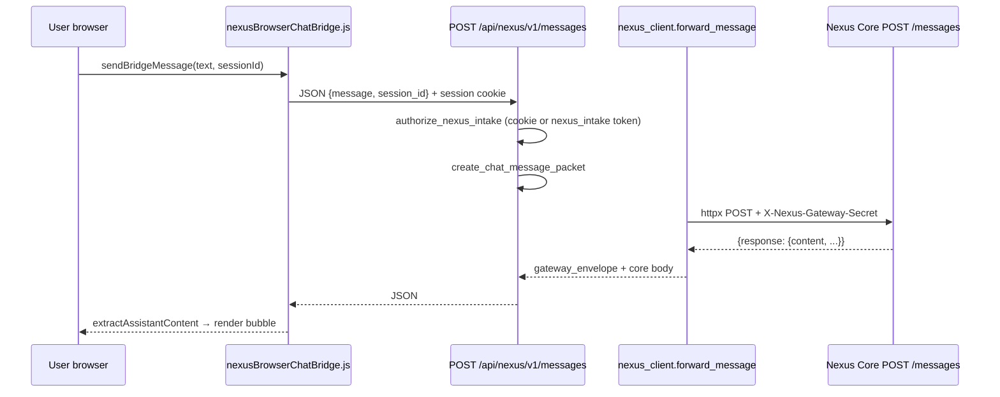
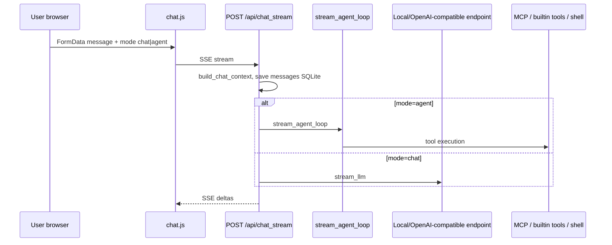
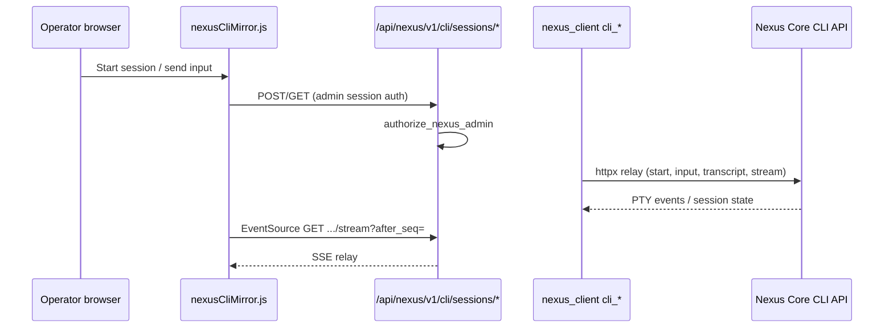
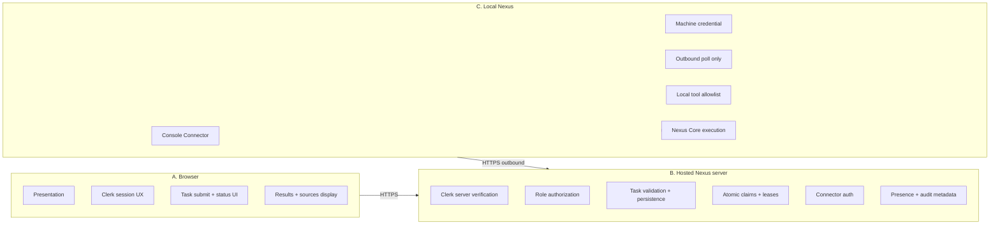
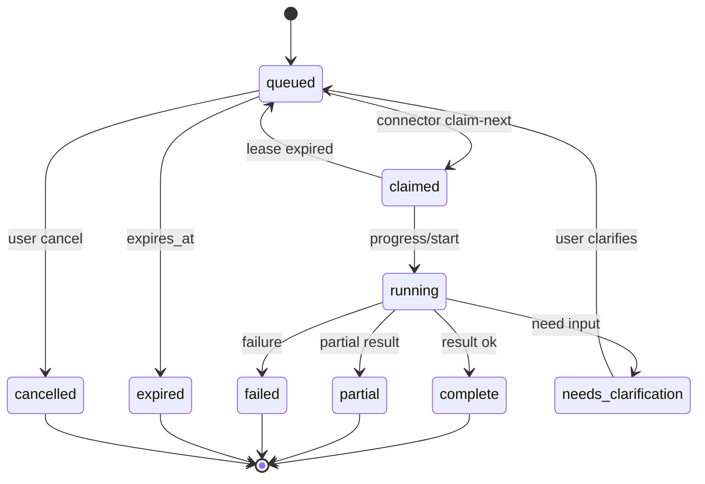
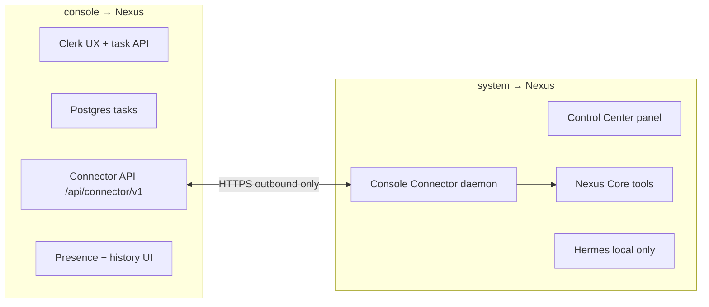
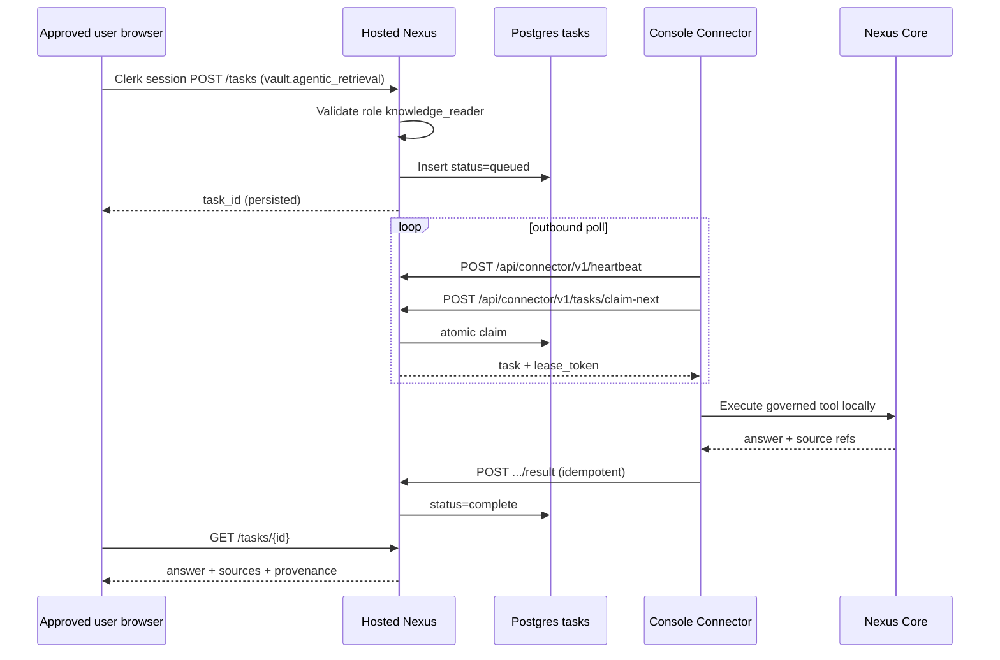

# Nexus Hosted Application Architecture Audit v1

| Field | Value |
|-------|-------|
| **Document** | `docs/specs/nexus_hosted_console_architecture_audit_v1.md` |
| **Pass type** | Architecture audit and specification only — **no implementation** |
| **Date** | 2026-06-30 |
| **Repository audited** | `/Users/bretthoffman/Documents/console` |
| **Related repository** | `/Users/bretthoffman/Documents/system` (read-only references; no changes from this pass) |
| **Product rename** | Hosted application → **Nexus**; local OS/authority → **Nexus**; outbound poller → **Console Connector** |

> **Superseded target architecture (2026-06-30):** Railway/Fly.io, managed PostgreSQL, and long-running uvicorn as the **hosted Nexus runtime** are no longer the selected direction. Current-state findings in this document remain valid. For the authoritative hosted implementation target, see **[nexus_vercel_convex_architecture_correction_v1.md](./nexus_vercel_convex_architecture_correction_v1.md)** (Vercel + GitHub + Next.js/TypeScript + Clerk + Convex).

---

## 1. Executive summary

The repository currently ships **legacy local console** — a reformed **Odysseus** codebase that is a **FastAPI + uvicorn Python server** serving a **vanilla ES-module SPA** (no frontend build step). It was designed as a **private, co-located UI/Gateway shell** on the Nexus Mac, forwarding work to **Nexus Core** over loopback HTTP when `NEXUS_CORE_URL` is set.

**Nexus** (the future hosted product) is **not present** in the codebase today. There are **zero** references to "Nexus". The intended product boundary requires:

- **Nexus** = singular hosted, Clerk-authenticated web application with durable task persistence.
- **Nexus** = private local OS and execution authority on the Nexus Mac.
- **Console Connector** = managed local subsystem that polls Nexus outbound-only.
- **No inbound public tunnel** to Nexus Core.

### Readiness assessment

| Area | Current state | Hosted Nexus readiness |
|------|---------------|------------------------|
| Framework | FastAPI + static SPA | Suitable backend pattern; needs hosting migration |
| Auth | bcrypt + cookie sessions (`data/auth.json`) | **Not suitable** for internet-hosted multi-tenant; Clerk required |
| Task queue | None on Gateway; Core `/tasks` read passthrough only | **Missing** — primary Phase 3–5 work |
| Connector API | None (`/api/connector/v1` does not exist) | **Missing** |
| Nexus communication | Synchronous HTTP forward to `NEXUS_CORE_URL` | **Incompatible** with offline Nexus / outbound-only model |
| Persistence | SQLite file (`data/app.db`) + JSON (`auth.json`, `sessions.json`) | **Not suitable** for multi-user hosted deployment |
| Branding | "legacy local console" throughout UI | Must rename visible hosted branding to **Nexus** |

### First milestone gap

Boss signs into Nexus → Sage KB question → task persists while Nexus offline → connector claims → `vault.agentic_retrieval` → structured answer displayed.

**Blockers today:** no Clerk, no hosted task DB, no connector API, no Console Connector in `system`, no role `knowledge_reader`, browser still assumes co-located Gateway↔Core HTTP, and Core HTTP API may still be scaffold-only (see Bridge 00 audit in `docs/console_reform/package_bridge_00_integration_audit.md`).

### Audit recommendation (not an implementation decision)

1. **Phase 2:** Nexus rename + strip co-location assumptions from hosted-facing surfaces.
2. **Phase 3:** PostgreSQL (or equivalent) task persistence on Nexus.
3. **Phase 4:** Versioned `/api/connector/v1/*` contract on Nexus.
4. **Phase 5:** Console Connector in `system` (handoff point).
5. **Phase 7:** Read-only tool allowlist (`vault.agentic_retrieval`, `membership_io.transcript_retrieve`).
6. **Phase 8:** Deploy Nexus to **Railway** or **Fly.io** (audit recommendation — see §16).

**Explicit non-goals for this pass:** hosted task queue, local connector, connector APIs, DB migrations, deployment conversion, broad UI redesign — **none were implemented**.

---

## 2. Current architecture

### 2.1 Framework and runtime

| Component | Technology |
|-----------|------------|
| Application framework | **FastAPI** (`app.py`) |
| ASGI server | **uvicorn** (`start-macos.sh` line 207: `python -m uvicorn app:app`) |
| Backend language | Python 3.11+ |
| Frontend | Static HTML + ES modules under `static/` (no webpack/vite) |
| Server entry point | `app.py` |
| Browser entry point | `GET /` → `static/index.html` (CSP nonce injection) |
| Python packaging | `requirements.txt`, `pyproject.toml` (`name = nexus-console`) |
| Node packaging | `package.json` (`name = nexus-console`) — dev tooling only (`@antithesishq/bombadil`) |
| ORM / DB | SQLAlchemy + SQLite default (`DATABASE_URL=sqlite:///./data/app.db`) |
| Vector store | ChromaDB (optional Docker service) |
| Web search | SearXNG (optional Docker service) |
| Templates | None (static HTML with `{{CSP_NONCE}}` replacement) |
| Process model | Single uvicorn process; asyncio background tasks at startup |

### 2.2 Local development and production commands

| Command | Purpose |
|---------|---------|
| `./start-macos.sh` | Primary macOS operator path: Homebrew deps, venv, `setup.py`, uvicorn |
| `NEXUS_CONSOLE_MODE=true ./start-macos.sh` | Recommended dedicated Nexus Mac Console Mode |
| `docker compose up` | Reference/compatibility stack (not primary for Nexus Mac GPU) |
| `python setup.py` | First-run: data dirs, SQLite schema, `data/auth.json` admin |
| `pytest` | Test suite under `tests/` |

**Default bind:** `127.0.0.1:7860` (`APP_BIND` / `APP_PORT` / `ODYSSEUS_HOST` / `ODYSSEUS_PORT`).

### 2.3 Static asset architecture

- Mounted at `/static` via `StaticFiles` with `Cache-Control: no-cache` for `.js`/`.css`/`.html`.
- PWA: `static/manifest.json`, `static/sw.js` (service worker filename retained from Odysseus).
- No bundler; modules import relatively (`static/js/*.js`).

### 2.4 Real-time and subprocess patterns

| Pattern | Usage |
|---------|-------|
| **SSE** | `POST /api/chat_stream`, `GET /api/nexus/v1/stream/{packet_id}`, `GET /api/nexus/v1/cli/sessions/{id}/stream`, `GET /api/shell/stream` |
| **EventSource (browser)** | CLI Mirror (`nexusCliMirror.js`), chat streaming |
| **WebSocket** | Not used for primary chat |
| **PTY** | `routes/shell_routes.py` (admin-only local shell); CLI Mirror via Core relay |
| **subprocess** | Shell routes, cookbook, builtin actions, Hermes runtime validation |
| **httpx async** | Nexus Core forwarding (`src/nexus_client.py`) |
| **Polling** | Calendar reminders (browser → `/api/notes`), dashboard auto-refresh 60s |

### 2.5 Deployment assumptions

- **Primary:** native macOS on Nexus Mac (`start-macos.sh`, Metal GPU for Cookbook).
- **Secondary:** Docker Compose with loopback binds, volume-mounted `./data`.
- **Private PWA:** installable; not designed for public internet multi-tenant hosting.
- **Filesystem:** heavy use of `./data/` (SQLite, uploads, Chroma, auth.json, generated images).
- **Co-location:** `NEXUS_CORE_URL=http://127.0.0.1:8080` assumes Gateway can reach Core on same machine or trusted LAN.

### 2.6 macOS-specific behavior

- `start-macos.sh`: Homebrew, arm64 Python selection, port 7860 (avoids AirPlay 7000).
- `build-macos-app.sh`: native .app bundle.
- `src/hermes_runtime.py`: default `NEXUS_SYSTEM_ROOT=/Users/bretthoffman/Documents/system`.
- Platform checks in shell routes (`pty` unavailable on Windows).

### 2.7 High-level current architecture diagram

```mermaid
flowchart TB
  subgraph Browser["Browser (PWA SPA)"]
    UI[index.html + static/js/*]
    ChatBridge[nexusBrowserChatBridge.js]
    CliMirror[nexusCliMirror.js]
    Dashboard[nexusDashboard.js]
  end

  subgraph ConsoleHost["Nexus Mac — console process"]
    FastAPI[FastAPI app.py]
    AuthMW[AuthMiddleware cookie + Bearer]
    ChatRoutes[/api/chat*]
    NexusGW[/api/nexus/v1/* Gateway]
    LegacyRoutes[/api/shell /api/cookbook /api/research ...]
    SQLite[(SQLite data/app.db)]
    AuthJSON[(data/auth.json sessions)]
    NexusClient[nexus_client.py httpx]
    HermesResolver[hermes_runtime.py path resolver]
  end

  subgraph NexusSystem["Nexus Mac — system"]
    CoreHTTP[Nexus Core HTTP API scaffold/ partial]
    HermesPTY[Hermes PTY sessions]
    Tools[Governed tool registry]
  end

  UI --> FastAPI
  ChatBridge --> NexusGW
  CliMirror --> NexusGW
  ChatRoutes -->|Console Mode| NexusClient
  ChatRoutes -->|Legacy Mode| AgentLoop[agent_loop.py]
  NexusGW --> NexusClient
  NexusClient -->|NEXUS_CORE_URL| CoreHTTP
  CoreHTTP --> HermesPTY
  CoreHTTP --> Tools
  FastAPI --> SQLite
  FastAPI --> AuthJSON
  LegacyRoutes --> AgentLoop
  LegacyRoutes --> ShellPTY[shell_routes PTY]
```

### 2.8 legacy local console Mode

Enabled via `NEXUS_CONSOLE_MODE=true` (`src/console_mode.py`):

- Disables in-process `TaskScheduler`, email pollers, `bg_monitor`, MCP auto-connect.
- Chat routes demoted to Gateway forward (`src/nexus_chat_bridge.py`).
- Authority guards block local memory/skills/shell/MCP/research writes (`src/*_console_guard.py`).
- Frontend hides/dims legacy execution UI (`static/js/nexusConsoleMode.js`).

This mode is a **local deployment profile**, not a hosted Nexus profile.

---

## 3. Current request-flow diagrams

### 3.1 Simple Chat (Console Mode + Core configured) — "Browser Chat Bridge"



**Survives Nexus offline?** **No** — synchronous forward; user sees unreachable/timeout message.

**Same-machine assumption?** **De facto yes** — `NEXUS_CORE_URL` typically loopback; 5s httpx timeout (`DEFAULT_TIMEOUT_S`).

**Hosted Nexus compatible?** **No** — requires Nexus→Core inbound HTTP from hosted server or co-located Gateway.

### 3.2 Simple Chat (Console Mode + `/api/chat_stream` fallback path)

When bridge not used, `routes/chat_routes.py` checks `is_console_mode()` and calls `console_mode_chat_stream` → `forward_message` → same Core path, wrapped as SSE.

### 3.3 Simple Chat (Legacy / non-Console Mode)



**Security boundary:** mode is **browser-supplied** `FormData.mode`; server enforces privileges via `_enforce_chat_privileges` but agent/chat is not a hard security boundary in legacy mode.

### 3.4 CLI Mirror request path



**Routes:** `GET/POST /api/nexus/v1/cli/sessions`, `.../input`, `.../transcript`, `.../stream`, `.../stop`, `.../interrupt`.

**Hosted Nexus compatible?** **No** — admin PTY mirror is operator-local surface; must not ship on public Nexus (remove or gate to break-glass local recovery only).

### 3.5 Model selection path

| Step | Component | Route |
|------|-----------|-------|
| UI read | `nexusModelSelector.js` | `GET /api/nexus/v1/model-config` |
| UI write | admin only | `POST /api/nexus/v1/model-config` |
| Gateway | `nexus_client.get_model_config` / `update_model_config` | Forwards to Core |
| Legacy | `modelPicker.js`, `models.js` | `/api/model-endpoints`, local SQLite `ModelEndpoint` |

Console Mode: Gateway **never reads** local Hermes YAML (`src/hermes_runtime.py` is status-only).

### 3.6 Gateway health / doctor / heartbeat

| Check | Route | Auth | Notes |
|-------|-------|------|-------|
| Gateway liveness | `GET /api/nexus/v1/health` | **Exempt** (no auth) | Probes Core `/health` if configured |
| App liveness | `GET /api/health` | Exempt | `{status: healthy}` |
| Readiness | `GET /api/ready` | Protected | DB + data dir checks |
| Hermes layout | embedded in gateway health | — | `hermes_runtime_status()` path validation only |
| Deployment warnings | `collect_deployment_warnings()` | — | AUTH_ENABLED, bind address, etc. |

No connector heartbeat exists today.

### 3.7 Scheduled / cron behavior

| Mechanism | Location | Console Mode |
|-----------|----------|--------------|
| In-process scheduler | `src/task_scheduler.py` | **Disabled** |
| Email pollers | `routes/email_pollers.py` | **Disabled** |
| Calendar reminders | Browser `static/js/calendar/reminders.js` | Still runs client-side |
| `ScheduledTask` / `TaskRun` | SQLite `core/database.py` | Legacy Odysseus automation, not Nexus queue |
| Webhook triggers | `/api/tasks/{id}/webhook/{token}` | Auth exempt via path token |

---

## 4. Authentication and authorization audit

### 4.1 Clerk

**Clerk does not exist** in this repository. Prior reform docs explicitly list Clerk as a non-goal (Package 20 handoff). No `@clerk/*` dependencies.

### 4.2 Current auth model

| Layer | Implementation |
|-------|----------------|
| Human auth | `core/auth.py` — bcrypt passwords in `data/auth.json` |
| Session | Cookie `odysseus_session` (7-day TTL), persisted `data/sessions.json` |
| Machine auth | Bearer tokens `ody_*` in SQLite `api_tokens` table with scopes |
| 2FA | Optional TOTP per user (`pyotp`) |
| Admin | `is_admin` flag on user record |
| Privileges | Per-user JSON: `can_use_agent`, `can_use_bash`, `allowed_models`, `max_messages_per_day`, etc. |

### 4.3 Middleware behavior (`app.py` AuthMiddleware)

- `AUTH_ENABLED=false` → middleware not installed.
- `LOCALHOST_BYPASS=true` → direct loopback without proxy headers bypasses auth (**dev only**).
- Exempt routes: login/setup/status, `/static`, `/api/health`, **`/api/nexus/v1/health`**, webhook pattern.
- Internal tool bypass: `X-Odysseus-Internal-Token` + trusted loopback → `current_user = internal-tool` (admin-equivalent).
- API bearer: `Authorization: Bearer ody_*` → `current_user = api` with scopes.

### 4.4 Nexus Gateway authorization (`src/nexus_scopes.py`)

| Scope | Routes |
|-------|--------|
| Session cookie (any logged-in user) | intake, read (fallback) |
| `nexus_intake` | POST intake/messages/sources |
| `nexus_read` | GET packets, stream, model-config |
| `nexus_worker` | POST worker-output |
| `nexus_admin` | approvals resolve, model-config POST, **all CLI routes** |

**Gap:** Session-authenticated non-admin users can call intake/messages — not role-scoped to `knowledge_reader`.

### 4.5 Browser-trusted auth/authority (security findings)

| Location | What browser controls | Server trust |
|----------|----------------------|--------------|
| `chat.js` | `mode` = `chat` \| `agent` | Server reads FormData; legacy path honors agent mode |
| `chat.js` | `preset_id`, web toggle | Used for context/tool permission hints |
| `init.js` | Can hide Agent toggle via features | UI only unless features API disables |
| `/api/auth/status` | Returns `privileges` object | Server-computed but **UI enforcement is primary** for hiding controls |
| `nexusCliMirror.js` | `localStorage` session id, mode | Server validates admin on API |
| `storage.js` / many modules | `odysseus-*` localStorage keys | Preferences only |
| Shell / cookbook | Admin routes | Server enforces `require_admin` |

**CSRF:** Cookie auth uses `SameSite=Lax`; no explicit CSRF token on POST forms. Same-site SPA mitigates somewhat; cross-site risk remains for cookie-auth deployments.

**Cookie security:** `SECURE_COOKIES` env (default false). `httponly=true`.

### 4.6 Routes callable without authentication (when AUTH_ENABLED=true)

- `/api/auth/setup`, `/signup`, `/login`, `/logout`, `/status`, `/features`, `/settings`, `/integrations/presets`
- `/api/health`, `/api/nexus/v1/health`, `/api/version`
- `/static/*`
- `/api/tasks/{id}/webhook/{token}` (path-embedded secret)
- `/login` HTML
- `/backgrounds` (explicitly no auth in `app.py`)

### 4.7 Suitability for internet-hosted deployment

| Aspect | Verdict |
|--------|---------|
| Password auth in JSON file | **Unsuitable** — use Clerk + server-verified JWT/session |
| SQLite on local disk | **Unsuitable** for multi-instance hosted |
| LOCALHOST_BYPASS | **Must be impossible** in production |
| Unauthenticated gateway health | Low risk; consider rate limiting |
| Shared-secret Core forward | Wrong trust model for hosted Nexus (hosted must not reach Core inbound) |
| Per-user privileges in flat JSON | Needs Clerk org roles + server-side policy engine |

---

## 5. Persistence audit

### 5.1 Mechanisms inventory

| Store | Path / table | Authority | Multi-user | Hosted suitability |
|-------|--------------|-----------|------------|-------------------|
| SQLite | `data/app.db` | Server | Owner column on many tables | Poor (file-based, single-writer) |
| Auth users | `data/auth.json` | Server | Yes (usernames) | Poor |
| Session tokens | `data/sessions.json` | Server | Yes | Poor |
| Chat sessions/messages | `sessions`, `chat_messages` | Server + `owner` | Partial | Needs Postgres + Clerk user id |
| ScheduledTask / TaskRun | `scheduled_tasks`, `task_runs` | Server | `owner` column | **Different domain** — not Nexus connector queue |
| API tokens | `api_tokens` | Server | Per-owner | Pattern reusable for connector creds |
| Uploads / files | `data/uploads/*` | Server filesystem | Owner-scoped routes | Needs object storage |
| Chroma / RAG | `data/chroma`, `data/rag` | Server | Partial | Local-only assumption |
| Memories | `memories` table + vectors | Server | Owner-scoped | Not for hosted vault duplication |
| Browser localStorage | `odysseus-*`, `nexus-*` keys | Browser | Per-browser | Not authoritative |
| In-memory | `_active_streams`, token cache, agent runs | Process | Single instance | Lost on restart |
| Core task ledger | Nexus Core `/tasks` (read via Gateway) | Core | Unknown | Source of truth for Core packets, not Nexus |

### 5.2 Reusable abstractions?

| Abstraction | Reusable for Nexus? |
|-------------|---------------------|
| `ScheduledTask` / `TaskRun` | **No** — cron/LLM automation model, no claim/lease |
| `nexus_packets.py` envelope | **Partial** — packet shape useful for trace metadata |
| Gateway `/packets` read passthrough | **Partial** — read pattern only |
| `api_tokens` + scopes | **Partial** — machine auth pattern, needs connector-specific scopes |
| Chat `Session` / `ChatMessage` | **Partial** — UI history, not connector task state |

**No existing Nexus task queue, atomic claim, lease, or idempotency implementation.**

### 5.3 Schema notes for `ScheduledTask` (legacy)

Key fields: `id`, `owner`, `prompt`, `task_type`, `action`, `schedule`, `next_run`, `status`, `webhook_token`, `max_steps`. Statuses: `active`, `paused`, `completed`. **Not mapped** to Nexus task statuses.

---

## 6. Hosting blockers

### 6.1 Blocker inventory

| ID | Blocker | Severity | Evidence |
|----|---------|----------|----------|
| B01 | No Clerk / no federated identity | Critical | `core/auth.py` |
| B02 | SQLite file DB | Critical | `DATABASE_URL` default |
| B03 | No hosted task queue | Critical | Not implemented |
| B04 | No connector API | Critical | No `/api/connector/v1` |
| B05 | Synchronous Core HTTP from Gateway | Critical | `nexus_client.py` 5s timeout |
| B06 | `NEXUS_CORE_URL` loopback assumption | Critical | `.env.example` |
| B07 | No atomic claims / leases / idempotency | Critical | — |
| B08 | Admin shell/PTY routes | Critical | `routes/shell_routes.py`, CLI mirror |
| B09 | `LOCALHOST_BYPASS` / `AUTH_ENABLED=false` | High | `app.py` |
| B10 | Internal tool token admin bypass | High | `core/middleware.py` |
| B11 | Unauthenticated `/api/nexus/v1/health` | Medium | `app.py` AUTH_EXEMPT |
| B12 | Browser-supplied chat `mode` | High | `chat.js` |
| B13 | Hardcoded macOS paths | High | `hermes_runtime.py` default root |
| B14 | Filesystem-heavy data dir | High | `setup.py` DIRS |
| B15 | Single uvicorn process state | High | `agent_runs`, streams |
| B16 | Long-lived SSE streams | Medium | chat, CLI mirror |
| B17 | No rate limits on most routes | Medium | Only auth login/signup limited |
| B18 | CORS defaults localhost | Medium | `ALLOWED_ORIGINS` |
| B19 | `SECURE_COOKIES=false` default | Medium | `auth_routes.py` |
| B20 | PWA/service worker same-origin assumptions | Low | `sw.js` |
| B21 | Docker reference stack not production-hardened | Medium | `docker-compose.yml` |
| B22 | No connector presence model | High | Dashboard placeholder |
| B23 | Branding implies browser = Nexus | Medium | manifest, titles |
| B24 | Co-located Chroma/SearXNG/Ollama | Medium | optional services |
| B25 | Webhook tasks without user auth | Medium | by design for integrations |
| B26 | No request size limits beyond upload route | Medium | — |
| B27 | Session cancel on browser close | Medium | SSE abort semantics |
| B28 | `data/auth.json` not concurrency-safe for cluster | High | file JSON |
| B29 | Odysseus legacy agent loop still present | High | `src/agent_loop.py` when not Console Mode |
| B30 | No `knowledge_reader` role | Critical | — |

---

## 7. Browser / server / local-Nexus boundary map

### 7.1 Target zones



### 7.2 Current violations (code that blurs boundaries)

| Code | Violation |
|------|-----------|
| `nexus_client.py` | Hosted Gateway would need **inbound** reachability to Core |
| `nexusBrowserChatBridge.js` | Browser triggers synchronous Core forward |
| `nexusCliMirror.js` + CLI routes | Browser operates Hermes PTY via Gateway→Core |
| `routes/shell_routes.py` | Server runs shell/PTY on app host |
| `src/agent_loop.py` | Server executes tools/MCP locally |
| `routes/cookbook_routes.py` | Server SSH/subprocess to GPU hosts |
| `hermes_runtime.py` on Console host | Implies Hermes lives on same machine as UI |
| `LOCALHOST_BYPASS` | Browser loopback == authenticated |
| `chat.js` agent mode | Browser chooses execution authority level |
| Dashboard `GET /api/nexus/v1/health` unauthenticated | Information disclosure |
| `NEXUS_GATEWAY_SHARED_SECRET` | Shared secret between Gateway and Core — wrong axis for Nexus↔Connector |

### 7.3 What should eventually live where

| Capability | Browser | Nexus | Console Connector |
|------------|---------|-------|-------------------|
| Ask Sage KB question | Submit UI | Validate role, enqueue task | Claim, execute `vault.agentic_retrieval` |
| Chat history display | Render | Persist task + answer metadata | — |
| CLI Mirror | **Remove** from hosted | **Remove** | Local operator tool only |
| Model admin | Read-only display | Store requested model in task | Apply via Core config |
| Approvals | Display + human resolve | Persist decision | Execute after local confirm |
| Presence | Display | Derive from connector heartbeat | Emit heartbeat |

---

## 8. Nexus rename inventory and matrix

### 8.1 Search summary

| Term | Approx. matches (py/js/html/css/json/md) | Notes |
|------|------------------------------------------|-------|
| Nexus / nexus | 100+ files | Mix of branding vs backend |
| Odysseus / odysseus | 100+ files | Legacy internal compatibility |
| Nexus / nexus | **0** | New name not started |
| Clerk | Docs only (non-goal mentions) | Not implemented |

### 8.2 Rename matrix (representative — full pass in Phase 2)

| Current reference | Context | Proposed replacement | Change for hosting? | Compatibility risk | Notes |
|-----------------|---------|----------------------|---------------------|-------------------|-------|
| legacy local console | Page title, README, FastAPI title | **Nexus** | Yes | Low | Primary branding |
| Nexus | PWA `manifest.json` name | **Nexus** | Yes | Medium (installed PWA) | Users reinstall PWA |
| Nexus Chat | Session default name, meta | **Nexus Chat** or neutral | Yes | Low | |
| Message Nexus... | Chat placeholder | **Ask Nexus...** | Yes | Low | `static/app.js` |
| legacy local console Mode | Env + banner | **Nexus deployment mode** OR remove in hosted | Partial | High | Env `NEXUS_CONSOLE_MODE` retain internally |
| legacy local console CLI Mirror | CLI panel title | Remove from hosted / rename local-only | Yes | Low | Not for Nexus |
| nexus-console | npm/pyproject package name | `nexus` or `nexus-app` | Later | High | PyPI/npm if published |
| console | repo folder | `nexus` (future) | Later | High | Git remote URLs |
| `/api/nexus/v1/*` | Gateway routes | **Keep** initially | No | **High** | Compatibility-sensitive API |
| `nexus_intake` scope | API token scope | Retain | No | High | Machine clients |
| `nexusDashboard.js` | File name | `nexusDashboard.js` (Phase 2) | Later | Medium | |
| `nexus-cli-mirror-*` CSS classes | CLI mirror UI | Local-only module | Hosted: remove | Low | |
| Nexus Core | Backend OS | **Retain Nexus** | No | N/A | Correct boundary |
| Nexus Gateway | Forward layer | **Retain** for local dev; hosted becomes Nexus API | Partial | Medium | |
| Console Connector | Architecture term | **Retain** | No | N/A | |
| NEXUS_CORE_URL | Env | **Retain** (local) | No | High | |
| NEXUS_SYSTEM_ROOT | Env | **Retain** | No | High | Local only |
| NEXUS_CONSOLE_MODE | Env | Retain → add `NEXUS_HOSTED_MODE` | Partial | High | |
| odysseus_session | Cookie name | `nexus_session` (with migration) | Yes | **High** | Breaking for sessions |
| odysseus-theme | localStorage | `nexus-theme` (migrate read) | Later | Medium | |
| X-Odysseus-Internal-Token | Header | Retain internal-only | No | High | |
| Odysseus | Internal code comments | Retain in legacy modules | No | Low | |

### 8.3 Classification rules applied

- **Rename to Nexus now (user-visible hosted):** titles, manifest, placeholders, welcome, operator docs aimed at end users.
- **Retain Nexus:** Core, backend, authority, connector (local), env vars pointing at local install.
- **Compatibility-sensitive / migrate later:** `/api/nexus/v1`, token scopes, cookie names, package names.
- **Internal-only harmless:** `odysseus` in variable names, test fixtures, reform docs path `console_reform/`.
- **Ambiguous — decision needed:** "Nexus Gateway" label on hosted — see §20 Q1.

---

## 9. Proposed hosted task domain model

**Specification only — not implemented.**

### 9.1 Record fields

```yaml
task_id: uuid (primary key)
requesting_clerk_user_id: string (indexed)
requesting_user_role: enum (e.g. knowledge_reader)
requested_tool_id: string (e.g. vault.agentic_retrieval)
validated_arguments: jsonb (server-validated after schema check)
authority_level: enum (read_only | write_deferred)
created_at: timestamptz
expires_at: timestamptz
status: enum (see §10)
connector_id: string nullable (set on claim)
claimed_at: timestamptz nullable
lease_expires_at: timestamptz nullable
lease_token: string nullable (unguessable, rotated on renew)
attempt_number: int default 1
task_version: int default 1 (optimistic concurrency)
idempotency_key: string nullable unique per user+tool+hash(args)
progress: jsonb nullable {phase, percent, message}
answer: jsonb nullable {text, format}
sources: jsonb[] nullable [{source_id, title, location, excerpt?, tool_id, retrieved_at}]
warnings: text[] nullable
partial: boolean default false
structured_error: jsonb nullable {code, message, retryable}
model: string nullable (display only)
trace_id: uuid
started_at: timestamptz nullable
completed_at: timestamptz nullable
duration_ms: int nullable
audit_metadata: jsonb {ip_hash, user_agent, policy_version, ...}
```

### 9.2 Index recommendations

- `(status, created_at)` for queue ordering
- `(lease_expires_at)` where status in (`claimed`, `running`)
- `(requesting_clerk_user_id, created_at desc)` for history
- Unique `(requesting_clerk_user_id, idempotency_key)` where idempotency_key not null

---

## 10. State-transition table

### 10.1 Statuses

`queued` → `claimed` → `running` → (`complete` | `partial` | `failed` | `needs_clarification` | `needs_confirmation`)

Terminal: `complete`, `partial`, `failed`, `expired`, `cancelled`

### 10.2 Transitions

| From | To | Actor | Trigger |
|------|-----|-------|---------|
| — | `queued` | Nexus user route | Validated task submission |
| `queued` | `claimed` | Connector `claim-next` | Atomic claim success |
| `queued` | `cancelled` | Nexus user route | User cancel before claim |
| `queued` | `expired` | Timeout worker | `expires_at` passed |
| `claimed` | `running` | Connector | Optional explicit mark-running or first progress |
| `claimed` | `queued` | Timeout worker | Lease expired without renew |
| `running` | `complete` | Connector result post | Successful execution |
| `running` | `partial` | Connector result post | Partial result flag |
| `running` | `failed` | Connector failure post | Non-retryable or max attempts |
| `running` | `needs_clarification` | Connector | Structured needs-input |
| `running` | `needs_confirmation` | Connector | Write path (future) |
| `needs_clarification` | `queued` | Nexus user route | User supplies clarification → new task_version |
| `claimed`/`running` | `failed` | Timeout worker | `task_timeout_seconds` exceeded |
| `*` | `cancelled` | Administrator | Admin revoke |

### 10.3 State machine diagram



---

## 11. Claim, lease, retry, and idempotency model

**Specification only.**

### 11.1 Atomic claim-next

- Single SQL statement: `UPDATE tasks SET status='claimed', connector_id=?, claimed_at=now(), lease_expires_at=now()+interval, lease_token=?, attempt_number=attempt_number+1, task_version=task_version+1 WHERE task_id = (SELECT task_id FROM tasks WHERE status='queued' AND expires_at > now() ORDER BY created_at ASC FOR UPDATE SKIP LOCKED LIMIT 1) RETURNING *`
- **Eligibility:** `status=queued`, not expired, `requested_tool_id` in connector allowlist (also enforced locally).
- **Ordering:** FIFO by `created_at` initially; later priority by role.

### 11.2 Connector identity

- `connector_id`: UUID assigned at registration (installation ID).
- Stored server-side with credential; connector sends `X-Connector-Id` + auth.

### 11.3 Lease

| Parameter | Initial value |
|-----------|---------------|
| `claim_lease_seconds` | 900 |
| `lease_renewal_interval_seconds` | 60 (connector) |
| `task_timeout_seconds` | 1200 |

- Renew: `POST /api/connector/v1/tasks/{id}/lease/renew` with `lease_token`; extends `lease_expires_at` only if `task_version` matches.
- Stale write rejection: result/progress posts must include `task_version` + `lease_token`; mismatch → 409.

### 11.4 Idempotency

- **Submit:** `Idempotency-Key` header on user task creation → return existing task if same user+key.
- **Progress/result:** `idempotency_key` per POST body (connector-generated UUID); store `(task_id, endpoint, idempotency_key)` dedupe table.

### 11.5 Retry and recovery

| Failure type | Behavior |
|--------------|----------|
| Retryable (Core timeout, transient) | Return to `queued` if `attempt_number < max`; else `failed` |
| Permanent (validation, policy) | `failed` non-retryable |
| Connector crash | Lease expires → task returns `queued` |
| Mac sleep | Connector resumes renew; if lease lapses, reclaim |
| Duplicate execution | Prevented by claim atomicity + idempotent result posts |

### 11.6 Initial connector config (authoritative tunables — not hardcoded in code)

```yaml
console_connector:
  enabled: false
  start_with_control_center: false
  polling:
    idle_interval_seconds: 5
    offline_backoff_initial_seconds: 5
    offline_backoff_max_seconds: 60
    heartbeat_interval_seconds: 30
  execution:
    max_concurrent_tasks: 1
    claim_lease_seconds: 900
    lease_renewal_interval_seconds: 60
    task_timeout_seconds: 1200
  authority:
    allowed_tool_ids:
      - vault.agentic_retrieval
      - membership_io.transcript_retrieve
    allow_write_tools: false
    require_local_confirmation_for_writes: true
```

**Config location (future):** `system` Control Center config — not scattered env vars.

### 11.7 Concurrency rule

Initial connector: **`max_concurrent_tasks: 1`** — one in-flight task per installation.

---

## 12. Connector API contract

**Version:** `v1`  
**Prefix:** `/api/connector/v1`  
**Not a generic remote-tool API** — task lifecycle only.

### 12.1 Authentication (all endpoints)

| Header | Required | Description |
|--------|----------|-------------|
| `Authorization` | Yes | `Bearer <connector_secret>` or HMAC scheme (see §13) |
| `X-Connector-Id` | Yes | Installation UUID |
| `X-Request-Timestamp` | Yes | ISO8601 or unix ms; skew ≤ 300s |
| `X-Request-Nonce` | Yes | UUID; server stores short TTL dedupe |
| `X-Idempotency-Key` | On mutating posts | Replay protection |

**Clerk must never authenticate connector routes.**

### 12.2 Endpoints

#### `POST /api/connector/v1/heartbeat`

- **Auth:** Connector credential
- **Body:** `{connector_id, status: online|busy|error, current_task_id?, version, capabilities: {tool_ids:[]}}`
- **Response:** `{ok, server_time, queue_depth?, policy_version}`
- **Idempotency:** Optional; last-write-wins for presence
- **Errors:** 401 invalid cred, 403 revoked, 429 rate limit

#### `POST /api/connector/v1/tasks/claim-next`

- **Body:** `{connector_id, supported_tool_ids: string[], max_lease_seconds?: number}`
- **Response 200:** `{task: TaskEnvelope, lease_token, task_version}` or `{task: null}` if empty
- **Response 409:** Connector already holds a task (max_concurrent=1)
- **Transition:** `queued` → `claimed`

#### `POST /api/connector/v1/tasks/{task_id}/lease/renew`

- **Body:** `{lease_token, task_version}`
- **Response:** `{lease_expires_at, task_version}` incremented
- **Errors:** 409 stale version/token

#### `POST /api/connector/v1/tasks/{task_id}/progress`

- **Body:** `{lease_token, task_version, progress: {phase, percent?, message?}, idempotency_key}`
- **Transition:** may set `running` if status was `claimed`
- **Idempotency:** duplicate `idempotency_key` → 200 same ack

#### `POST /api/connector/v1/tasks/{task_id}/result`

- **Body:** `{lease_token, task_version, answer, sources[], warnings[], partial: bool, idempotency_key}`
- **Transition:** → `complete` or `partial`
- **Idempotency:** required

#### `POST /api/connector/v1/tasks/{task_id}/failure`

- **Body:** `{lease_token, task_version, structured_error: {code, message, retryable}, idempotency_key}`
- **Transition:** → `failed` or back to `queued` if retryable and attempts remain

#### `POST /api/connector/v1/tasks/{task_id}/release` (optional)

- **Body:** `{lease_token, task_version, reason}`
- **Transition:** `claimed`/`running` → `queued` (increment attempt)

#### `GET /api/connector/v1/queue/status`

- **Response:** `{queued_count, claimed_count, running_count, oldest_queued_at?}`
- **Auth:** Connector credential; no user PII

### 12.3 User-facing task routes (Nexus — separate family)

Suggested `/api/nexus/v1/tasks` or `/api/v1/tasks` (decision needed):

- `POST /tasks` — create (Clerk session, role check)
- `GET /tasks/{id}` — status + result
- `GET /tasks` — history
- `POST /tasks/{id}/cancel`

---

## 13. Human versus machine identity model

### 13.1 Human identity (Clerk)

| Attribute | Storage | Used for |
|-----------|---------|----------|
| Clerk user ID | Nexus DB | Task ownership, audit |
| Approved account flag | Nexus DB / Clerk metadata | Gate access |
| Role (`knowledge_reader`, …) | Nexus DB, server-side only | Tool allowlist at submission |
| Session | Clerk-managed | Browser auth |

**Never** accept role or tool authority from browser JSON without server verification against Clerk session + DB policy.

### 13.2 Machine identity (Console Connector)

| Attribute | Storage | Used for |
|-----------|---------|----------|
| `connector_installation_id` | Server + local config | Presence, claim attribution |
| Connector secret / API key | Server hash + local keychain | Bearer auth |
| Revocation list | Server | Immediate deny |
| TLS | Transport | Required |

### 13.3 Implementation options (tradeoffs)

| Option | Pros | Cons |
|--------|------|------|
| **A. Bearer token (ody_-style)** | Matches existing `api_tokens` pattern | Theft = full access until revoke |
| **B. HMAC signed requests** | Replay-resistant with nonce+timestamp | More client code |
| **C. mTLS** | Strong binding | Ops complexity, cert rotation |
| **D. Short-lived JWT from register endpoint** | Scoped tokens | Needs bootstrap exchange |

**Audit recommendation:** **B (HMAC)** or **A+nonce** for v1; avoid custom CA. Register connector via admin-provisioned one-time setup code → stores hashed secret locally in Keychain.

**Clerk ≠ Connector:** separate route trees, separate middleware, separate DB table (`connector_credentials`).

---

## 14. Presence / offline model

### 14.1 Display states (Nexus UI)

| State | Derivation |
|-------|------------|
| Nexus online | Heartbeat within `2 × heartbeat_interval_seconds` |
| Nexus offline | No heartbeat beyond threshold |
| Reconnecting | Heartbeat gap then new heartbeat within backoff window |
| Last seen | `max(last_heartbeat_at)` from connector record |
| Connector disabled | Config flag / no credential |
| Connector error | Last heartbeat `status=error` + message |
| Current task | Heartbeat `current_task_id` + task status join |
| Queue depth | Authorized users see count from `GET /api/.../presence` |

### 14.2 Server-side presence record

```yaml
connector_id:
last_heartbeat_at:
status: online|busy|offline|error|disabled
last_error:
current_task_id:
software_version:
```

**Never trust browser localStorage for presence.**

### 14.3 Heartbeat vs poll

Normal polling during `claim-next` idle loop doubles as liveness if heartbeat interval aligns; explicit heartbeat still required when idle (no tasks).

---

## 15. Source / provenance and data-minimization policy

### 15.1 Persist on Nexus (hosted DB)

- `source_id` (vault note id, transcript id)
- `title`, `location` (path/URI redacted if needed)
- `excerpt` — max 500 chars optional for UI preview
- `tool_id`, `retrieval_timestamp`
- `trace_id`, `task_id`
- `warnings[]`, `partial: true`

### 15.2 Do not persist

- Full vault note bodies
- Complete transcript text (unless excerpt policy explicitly allows bounded snippet)
- Raw Hermes PTY logs
- Machine credentials
- Internal Nexus file paths exposing home directory structure

### 15.3 Existing Console concerns

- Legacy chat stores full messages in SQLite — **hosted Nexus should not replicate vault content into chat tables**.
- Research/deep_research files under `data/deep_research/` — local only.
- CLI Mirror raw debug — **must not** feed hosted storage.

---

## 16. Deployment options and recommendation

### 16.1 Repository hosting requirements

| Requirement | Reason |
|-------------|--------|
| Long-running Python (uvicorn) | FastAPI app, background recovery worker |
| Managed PostgreSQL | Task queue, Clerk user mapping |
| Cron/worker process | Lease expiry, task expiration |
| Env secrets | Clerk, DB, connector HMAC pepper |
| SSE support | Optional for task progress UI (or poll) |
| No inbound Nexus | Connector outbound only |

### 16.2 Option evaluation

| Host | Python API | Postgres | Workers/cron | SSE/long request | Clerk | Verdict |
|------|------------|----------|--------------|------------------|-------|---------|
| **Vercel** | Poor (serverless limits) | External | Limited cron | SSE awkward | Good | **Poor fit** for uvicorn monolith |
| **Render** | Web service + worker | Yes | Yes | Yes | Good | **Good fit** |
| **Railway** | Service + cron | Plugin | Yes | Yes | Good | **Good fit** (audit recommendation) |
| **Fly.io** | Machines | Fly Postgres | Yes | Yes | Good | **Good fit** |
| **Docker on VPS** | Full control | Self-manage | systemd | Yes | Good | Viable with ops burden |

### 16.3 Audit recommendation

**Primary:** **Railway** or **Fly.io** — minimal migration from uvicorn, add Postgres plugin, separate worker dyno for lease recovery.

**Not recommended:** Vercel-only without rewriting to serverless functions.

**Database:** **PostgreSQL** (not SQLite, not Convex per current stack).

---

## 17. Security findings ranked by severity

| Rank | Finding | Severity | Location |
|------|---------|----------|----------|
| S1 | No federated auth; password file on disk | Critical | `core/auth.py` |
| S2 | Legacy agent loop + shell RCE surface on same app | Critical | `agent_loop.py`, `shell_routes.py` |
| S3 | Synchronous Core coupling prevents outbound-only security model | Critical | `nexus_client.py` |
| S4 | `LOCALHOST_BYPASS` / auth disabled modes | Critical | `app.py` |
| S5 | Browser selects agent vs chat mode | High | `chat.js` |
| S6 | Internal tool token grants admin on loopback | High | `middleware.py`, `app.py` |
| S7 | CLI Mirror exposes PTY to admin session holders | High | `nexus_routes.py` CLI family |
| S8 | SQLite + JSON auth not cluster-safe | High | `data/*` |
| S9 | Unauthenticated gateway health leaks Core config status | Medium | `/api/nexus/v1/health` |
| S10 | Webhook tasks auth-exempt by path token | Medium | `app.py` |
| S11 | CSRF not explicit on cookie POSTs | Medium | SPA forms |
| S12 | `SECURE_COOKIES` default false | Medium | `auth_routes.py` |
| S13 | Privileges exposed to browser for UI only | Low-Medium | `/api/auth/status` |
| S14 | Hardcoded developer paths in hermes_runtime | Low (info) | `hermes_runtime.py` |

---

## 18. Technical debt and dependency findings

### 18.1 Naming debt

- Dual naming: **legacy local console** (product) vs **Odysseus** (internal cookie, storage keys, headers).
- Reform docs under `docs/console_reform/` — historical; new specs under `docs/specs/`.

### 18.2 Architectural debt

- **Two chat paths:** legacy `agent_loop` vs Console bridge — hosted must use task queue only.
- **CLI Mirror PTY parsing** (`nexusCliMirrorHelpers.js`, Hermes classifier) — substantial experimental UI; **must not** become hosted architecture.
- **Gateway packet persistence placeholder** — honest but incomplete (`gateway_packets_list_placeholder`).
- **Core HTTP API** may be scaffold-only in `system` (Bridge 00).

### 18.3 Duplicate / legacy abstractions

- `ScheduledTask` vs future Nexus `tasks` — name collision risk; use `nexus_tasks` table name.
- Multiple search implementations (`services/search`, `src/search`).
- Odysseus cookbook SSH execution paths — irrelevant to Nexus MVP.

### 18.4 Test gaps (hosted)

- No tests for Clerk, connector API, claim lease, idempotency (expected — not built).
- Good coverage for Console Mode demotion (`tests/test_nexus_*`).

### 18.5 Dependencies

- Python: FastAPI, SQLAlchemy, httpx, bcrypt, uvicorn — standard; **no broad upgrade audit performed** (per instructions).
- Node: minimal devDeps only.
- **Convex:** mentioned in reform docs as non-goal; **not present**.

### 18.6 CLI Mirror status

- UI: mature operator panel (Bridge 09–13).
- Backend: Gateway relay to Core CLI API — **local operator feature only**.
- **Do not port** PTY transcript parsing to Nexus.

---

## 19. Sequenced implementation package plan

### Phase 1 — Current architecture audit ✅

**Package P1-audit:** This document.  
**Repo:** `console`  
**Deliverable:** `docs/specs/nexus_hosted_console_architecture_audit_v1.md`

---

### Phase 2 — Nexus rename and hosting-safe boundary work

| Package | Name | Scope | Prerequisites | Key files | Acceptance criteria |
|---------|------|-------|---------------|-----------|---------------------|
| **P2a** | Visible Nexus rebrand | User-facing titles, manifest, placeholders, login, README operator sections | P1 | `static/index.html`, `manifest.json`, `app.js`, `login.html`, `README.md` | Tests: branding assert Nexus not legacy local console in HTML |
| **P2b** | Hosted mode feature flag | `NEXUS_HOSTED_MODE` disables shell, CLI mirror, cookbook SSH, agent loop routes | P2a | `app.py`, `console_mode.py`, route guards | With flag on, `/api/shell` 404/disabled |
| **P2c** | Auth boundary prep | Document Clerk integration points; stub middleware interface | P2b | new `core/clerk_auth.py` stub | No Clerk secrets committed |
| **P2d** | Odysseus storage migration plan | Dual-read `nexus-theme` keys | P2a | `storage.js`, `theme.js` | Optional — batch with P2a |

**Non-goals:** Rename `/api/nexus/v1`, cookie names.  
**Security:** Remove hosted exposure of admin PTY.  
**Rollback:** Feature flag off.  
**Batch:** P2a+P2b sequential; P2d optional parallel.

---

### Phase 3 — Durable task persistence

| Package | Name | Scope | Prerequisites | Key files | Acceptance criteria |
|---------|------|-------|---------------|-----------|---------------------|
| **P3a** | Postgres schema + migrations | `nexus_tasks`, `connector_presence`, `connector_nonces`, `task_idempotency` | P2b, Postgres provisioned | `core/database.py` or Alembic | Migrations apply clean |
| **P3b** | User task API (Clerk) | POST/GET/cancel tasks | P3a, Clerk | `routes/nexus_task_routes.py` | Role `knowledge_reader` enforced server-side |
| **P3c** | Task validation | JSON schema per `requested_tool_id` | P3b | `src/nexus_task_validation.py` | Invalid args rejected 422 |

**Non-goals:** Connector execution.  
**Tests:** CRUD, role denial, idempotency key.

---

### Phase 4 — Connector API contract and hosted endpoints

| Package | Name | Scope | Prerequisites | Key files | Acceptance criteria |
|---------|------|-------|---------------|-----------|---------------------|
| **P4a** | Connector credential model | Register, revoke, hash secrets | P3a | `routes/connector_auth_routes.py` | Clerk cannot call connector routes |
| **P4b** | claim-next + lease | Atomic claim, renew, release | P4a | `routes/connector_v1_routes.py`, `src/nexus_claims.py` | Concurrent claim tests pass |
| **P4c** | progress/result/failure | Idempotent posts, version check | P4b | same | Duplicate post no double apply |
| **P4d** | Recovery worker | Lease expiry, task timeout | P4b | `src/nexus_recovery_worker.py` | Stale claimed task returns queued |

**Non-goals:** Local tool execution.  
**Security:** Nonce store, timestamp skew, rate limits.

---

### Phase 5 — Local legacy local console Connector

| Package | Name | Scope | Prerequisites | Key files | Acceptance criteria |
|---------|------|-------|---------------|-----------|---------------------|
| **P5a** | Connector daemon skeleton | Poll loop, config file | P4b | **`system`** repo | Outbound HTTPS only |
| **P5b** | Credential bootstrap | One-time pairing | P4a, P5a | Control Center UI (system) | Secret in Keychain |
| **P5c** | Local allowlist enforcement | `allowed_tool_ids` | P5a | connector config | Write tools rejected |

**HANDOFF POINT:** Nexus hosted API complete in `console`; **all outbound execution code lives in `system`**. Console repo must not grow a second Core bridge.

---

### Phase 6 — Nexus Control Center Connector panel

| Package | Name | Repo | Scope |
|---------|------|------|-------|
| **P6a** | Connector panel UI | system | Status, enable/disable, last error, queue depth |
| **P6b** | start_with_control_center | system | Launchd integration |

---

### Phase 7 — Read-only tool integration

| Package | Name | Scope | Acceptance |
|---------|------|-------|------------|
| **P7a** | `vault.agentic_retrieval` | Core tool + connector mapping | Sage KB answer with sources |
| **P7b** | `membership_io.transcript_retrieve` | Core tool | Transcript metadata + bounded excerpt |
| **P7c** | Nexus results UI | Sources panel, partial warnings | No full vault bodies stored |

**Milestone:** Boss E2E scenario from executive summary.

---

### Phase 8 — Production deployment

| Package | Name | Scope |
|---------|------|-------|
| **P8a** | Railway/Fly service definition | Dockerfile or nixpacks, env template |
| **P8b** | Clerk production tenant | Approved users, roles |
| **P8c** | Postgres managed + backups | |
| **P8d** | HTTPS, `SECURE_COOKIES`, CORS | |

---

### Phase 9 — Reliability and operational hardening

Rate limits, audit logging export, metrics, chaos tests on lease recovery, connector version compatibility checks.

---

### Phase 10 — Governed expansion

Agent mode, writes, confirmations — **only after** queue model proven.

---

### Repository responsibility boundary



---

## 20. Open questions and decisions requiring operator input

| ID | Question | Options |
|----|----------|---------|
| Q1 | Hosted product API prefix: retain `/api/nexus/v1` vs `/api/nexus/v1`? | Retain for compat vs clean break |
| Q2 | PWA manifest short name: "Nexus" only vs "Nexus by …"? | Branding |
| Q3 | Clerk org model: single org vs multi-tenant? | Affects DB schema |
| Q4 | First hosting target: Railway vs Fly.io? | Ops preference |
| Q5 | Keep CLI Mirror on local Nexus fork for operators? | Local-only module vs delete |
| Q6 | Migrate `odysseus_session` cookie or fresh login wall? | User disruption |
| Q7 | Excerpt max length for sources in DB? | 500 vs 2000 chars |
| Q8 | Connector auth: Bearer vs HMAC for v1? | Security vs velocity |
| Q9 | Is Nexus Core HTTP API implemented yet in system? | Blocks P7 |
| Q10 | Approved user list: Clerk allowlist vs invite-only? | Onboarding |

---

## 21. Explicit non-goals (this pass and near-term)

- Implementing hosted task queue, connector daemon, or connector routes
- Database migrations or production Postgres provisioning
- Clerk tenant creation or production secrets
- Renaming `/api/nexus/v1` or `NEXUS_*` env vars
- Modifying `system` from this repo
- Deploying to production hosting
- Removing Ollama/Cookbook legacy surfaces (local Nexus Mac may retain)
- Agent mode on hosted Nexus
- Inbound tunnels (ngrok, port forwarding) as architecture components
- Generic remote tool RPC API
- Broad dependency upgrades
- CLI Mirror transcript classifier as Nexus component

---

## 22. Audit evidence and inspected paths

### 22.1 Core application

- `app.py` — FastAPI app, auth middleware, route registration, lifecycle
- `start-macos.sh`, `setup.py`, `docker-compose.yml`, `.env.example`
- `pyproject.toml`, `package.json`, `requirements.txt` (referenced)

### 22.2 Authentication

- `core/auth.py`, `routes/auth_routes.py`, `core/middleware.py`
- `src/auth_helpers.py`, `src/nexus_scopes.py`, `routes/api_token_routes.py`

### 22.3 Nexus / Gateway

- `routes/nexus_routes.py`, `src/nexus_client.py`, `src/nexus_chat_bridge.py`
- `src/nexus_packets.py`, `src/console_mode.py`, `src/hermes_runtime.py`
- `src/authority_console_guard.py`, `src/nexus_deployment_posture.py`

### 22.4 Chat / agent / CLI

- `routes/chat_routes.py`, `routes/chat_helpers.py`, `src/agent_loop.py`
- `static/js/chat.js`, `static/js/nexusBrowserChatBridge.js`
- `static/js/nexusCliMirror.js`, `static/js/nexusCliMirrorHelpers.js`
- `static/js/nexusConsoleMode.js`, `static/js/nexusDashboard.js`
- `routes/shell_routes.py`

### 22.5 Frontend branding

- `static/index.html`, `static/manifest.json`, `static/app.js`
- `static/login.html`, `static/js/sessions.js`, `static/js/keyboard-shortcuts.js`
- `README.md`, `CONTRIBUTING.md`, `SECURITY.md`

### 22.6 Persistence

- `core/database.py` (`Session`, `ChatMessage`, `ScheduledTask`, `TaskRun`, `ApiToken`)

### 22.7 Prior integration audit

- `docs/console_reform/package_bridge_00_integration_audit.md`

### 22.8 Tests executed

```
./venv/bin/python3 -m pytest \
  tests/test_console_mode.py \
  tests/test_nexus_gateway_routes.py \
  tests/test_nexus_branding.py \
  tests/test_nexus_chat_demotion.py \
  tests/test_auth_regressions.py \
  -q --tb=no

Result: 50 passed, 5 warnings in 0.42s
```

### 22.9 Search terms used

Nexus, legacy local console, Nexus Chat, Message Nexus, Nexus, Clerk, auth, session, role, permission, agent, chat mode, CLI mirror, PTY, Hermes, Core, gateway, heartbeat, task, queue, database, sqlite, localStorage, subprocess, shell, localhost, Flask, uvicorn, ngrok, WebSocket, SSE, EventSource, convex — among others via ripgrep and semantic inspection.

---

## Appendix A — Future queued-task execution path (target)



---

## Appendix B — Trust boundaries (target)

```
┌─────────────────────────────────────────────────────────────┐
│  INTERNET                                                    │
│  ┌──────────────┐         HTTPS          ┌─────────────────┐ │
│  │   Browser    │ ◄──────────────────► │  Nexus (hosted)   │ │
│  │  Clerk JS    │   no machine creds   │  Clerk verify     │ │
│  └──────────────┘                      │  Task DB          │ │
│                                         │  Connector API    │ │
│                                         └────────▲──────────┘ │
└──────────────────────────────────────────────────│────────────┘
                                                   │ outbound only
┌──────────────────────────────────────────────────│────────────┐
│  Nexus Mac (private)                           │            │
│  ┌─────────────────┐      ┌────────────────────┴─────────┐  │
│  │ Console Connector│◄────►│  Nexus HTTPS                  │  │
│  └────────┬─────────┘      └──────────────────────────────┘  │
│           │ local only                                        │
│  ┌────────▼─────────┐                                        │
│  │  Nexus Core    │  NO inbound from internet              │
│  │  governed tools  │                                        │
│  └──────────────────┘                                        │
└──────────────────────────────────────────────────────────────┘
```

---

*End of audit v1. Phase 2 implementation must not begin until operator approves open decisions.*
