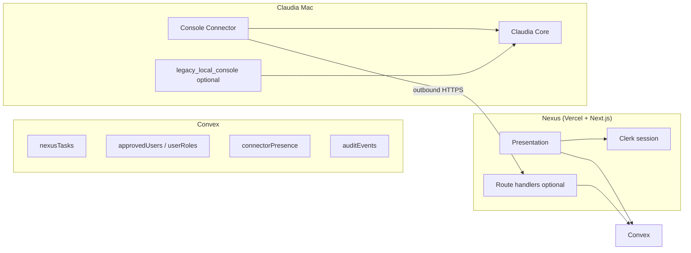
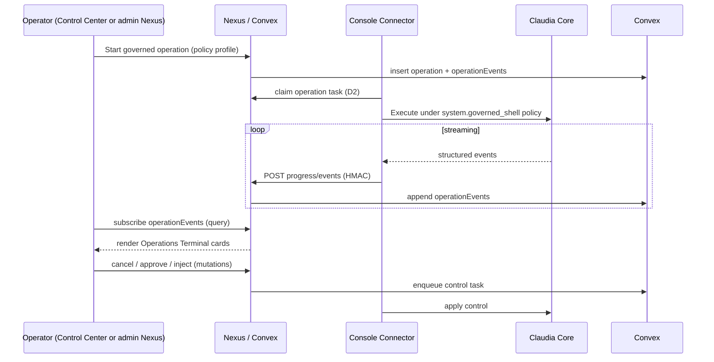

# Nexus Legacy Capability Migration Matrix (v1)

| Field | Value |
|-------|-------|
| **Document** | `docs/specs/nexus_legacy_capability_migration_matrix_v1.md` |
| **Package** | P3.5 — Promote Nexus to Repository Root and Establish Capability Migration Authority |
| **Status** | Authoritative specification (no implementation in this pass) |
| **Date** | 2026-06-30 |
| **Legacy reference tree** | `legacy_local_console/` |
| **Hosted application tree** | Repository root (`app/`, `components/`, `convex/`, `lib/`) |

> **Path update (P3.5):** Application paths formerly under `nexus/` were promoted to the **repository root** per [`nexus_repository_root_promotion_v1.md`](./nexus_repository_root_promotion_v1.md). Commands, Vercel Root Directory, and Convex live at repo root. Legacy Claudia Console is isolated under `legacy_local_console/`.

**Purpose:** Prevent feature loss during migration from the legacy FastAPI + static SPA Claudia Console to the hosted **Nexus** (Next.js + Clerk + Convex + Console Connector). This document is the single authority for *what each legacy capability becomes*, *where it persists*, *who executes it*, and *when it ships*.

**Related specs:**

- [`nexus_vercel_convex_architecture_correction_v1.md`](./nexus_vercel_convex_architecture_correction_v1.md) — hosted target architecture
- [`nexus_p3_ui_port_foundation_v1.md`](./nexus_p3_ui_port_foundation_v1.md) — P3 UI boundary
- [`nexus_repository_root_promotion_v1.md`](./nexus_repository_root_promotion_v1.md) — repo layout

---

## 1. Migration principles

These principles override convenience, nostalgia, and “just port the route.” When in conflict, the principle wins.

| # | Principle | Meaning |
|---|-----------|---------|
| P1 | **Preserve capability, not implementation** | User intent (ask a question, review history, approve an action) survives; FastAPI routes, PTY relays, SQLite shapes, and `odysseus-*` keys do not automatically survive. |
| P2 | **Nexus presents** | All hosted UI, layout, theme, task submission forms, history lists, diagnostics panels, and status chips live in the Next.js app at repo root. Nexus never runs Python, opens PTYs, or holds Claudia secrets. |
| P3 | **Convex persists** | Durable multi-user state (tasks, users, roles, connector presence, audit, bounded progress) lives in Convex. SQLite `data/app.db` and JSON flat files are **legacy-local only**. |
| P4 | **Connector transports** | Claudia Mac work crosses the trust boundary only via **Console Connector** outbound HTTPS to Nexus (`/api/connector/v1/*`). No inbound tunnel, no browser→Core HTTP, no Vercel→`CLAUDIA_CORE_URL`. |
| P5 | **Claudia governs** | Tool execution, shell, Hermes sessions, filesystem, email send, model endpoints, and MCP invocations remain on Claudia Core under governed policies. Nexus enqueues and displays; Claudia decides and executes. |
| P6 | **Hermes is not a Nexus concept** | “Hermes,” PTY mirrors, raw terminal bytes, and `/api/claudia/v1/cli/sessions/*` relay are **local operator patterns**. Hosted Nexus exposes **Nexus Operations Terminal** — a structured, audited event stream — not a browser PTY. |
| P7 | **No fake operational state** | Disabled controls, empty states, and `not_configured` badges are preferred over simulated online Claudia, fabricated tasks, or localStorage-backed history on Nexus. |
| P8 | **Source minimization** | Answers include bounded source references and provenance labels (“Retrieved via Claudia · `vault.agentic_retrieval`”), not full document dumps or arbitrary filesystem paths. |
| P9 | **Roles are authoritative in Convex** | Clerk proves identity; Convex `approvedUsers` + `userRoles` enforce policy. Legacy `auth.json` privileges (`can_use_bash`, etc.) do not map 1:1 without review. |
| P10 | **Legacy stays legacy until retired** | `legacy_local_console/` remains the compatibility surface for Claudia Mac until Nexus + Connector cover operator needs or explicit retirement. |

### Authority zones (summary)



---

## 2. Disposition categories (D1–D8)

Every capability, table, JSON store, and UI module receives exactly one primary disposition. Secondary notes (e.g. “stub now, full later”) reference phase, not a second disposition.

| Code | Name | Definition | Typical outcome |
|------|------|------------|-----------------|
| **D1** | **Nexus Port (Hosted Primary)** | Capability is a first-class Nexus feature with Convex persistence and Clerk auth. Claudia involved only via Connector when execution is required. | Chat tasks, task history, presence, sources panel |
| **D2** | **Connector Governed Task** | User action creates a `nexusTasks` row; Connector claims and runs an allowlisted Claudia tool; result written back to Convex. | KB retrieval, transcript fetch, future governed agent steps |
| **D2b** | *(subtag)* **Long-running local job** | Same as D2 but may exceed default lease; uses progress events + renewal. | Research, compare, image gen (if ever hosted-requested) |
| **D3** | **Legacy Local Retain** | Stays in `legacy_local_console/` for Claudia Mac operators; not required on hosted Nexus MVP. | Cookbook, local model admin, in-process agent loop |
| **D4** | **Remove / Anti-Pattern** | Must **not** be ported to Nexus; keeping in legacy is tolerated until retirement. Violates hosted security model if exposed publicly. | Browser PTY, shell RCE, inbound Core forward, Hermes mirror |
| **D5** | **Nexus Presentation Stub** | UI shell, disabled control, or empty state in Nexus; no backend execution until a later phase. | Agent toggle (hidden), composer (disabled in P3) |
| **D6** | **Convex Metadata Only** | Settings, preferences, or catalog data in Convex; no Claudia execution on submit. | Theme mode, user display prefs, connector install metadata |
| **D7** | **Claudia Control Center (Local Ops)** | Operator-facing execution UI belongs in `claudia_system` Control Center / local tools — **not** the public Nexus site. | Operations Terminal, governed shell, service controls, doctor |
| **D8** | **Operator Decision Required** | Material ambiguity: product scope, data migration, legal/compliance, or dual-home conflict. **Do not implement** until resolved and recorded in §11. | Email/calendar write scope, PWA offline parity, compare on hosted |

---

## 3. Nexus Operations Terminal (future design)

**Replaces:** Legacy **CLI Mirror** (`static/js/claudiaCliMirror.js`, `/api/claudia/v1/cli/sessions/*` → Core Hermes PTY relay).

**Does not replace:** Simple Chat task submit, read-only diagnostics in Nexus, or legacy local shell (`routes/shell_routes.py`) on Claudia Mac.

### 3.1 Design intent

| Legacy CLI Mirror | Nexus Operations Terminal |
|-------------------|---------------------------|
| Raw PTY bytes over SSE | Typed **event stream** with schema |
| Browser holds session attachment | Connector/Core hold session; Nexus subscribes to **redacted** events |
| Hermes session IDs in UI | **Claudia operation IDs** (`operationId`) — Hermes never labeled in Nexus |
| Operator types into PTY | Operator sends **structured commands** (continue, cancel, approve, inject message) |
| Transcript parsed client-side | Server-side classification; client renders cards |
| Public internet exposure | **D7** — Control Center or VPN-local Nexus admin extension only; default **not** on public MVP |

### 3.2 Event types (v1 taxonomy)

Events are append-only, sequenced (`seq`), scoped to `operationId`, stored in Convex `operationEvents` (future table) with retention cap.

| Event type | Payload (conceptual) | Consumer UI |
|------------|----------------------|---------------|
| `operation.started` | `{ operationId, title, initiatedBy, policyProfile }` | Session header |
| `operation.phase_changed` | `{ phase, message? }` | Status chip |
| `operation.output_delta` | `{ channel: "stdout"\|"stderr"\|"assistant", text, format: "plain"\|"markdown" }` | Transcript card (bounded) |
| `operation.tool_invoked` | `{ toolId, argumentsSummary, risk: "read"\|"write"\|"exec" }` | Tool chip |
| `operation.tool_result` | `{ toolId, ok, summary, sources? }` | Result card + sources |
| `operation.approval_requested` | `{ approvalId, action, expiresAt }` | Approval banner |
| `operation.approval_resolved` | `{ approvalId, decision }` | Audit line |
| `operation.progress` | `{ percent?, message }` | Progress bar |
| `operation.warning` | `{ code, message }` | Warning banner |
| `operation.error` | `{ code, message, recoverable }` | Error panel |
| `operation.completed` | `{ status: "success"\|"failed"\|"cancelled", durationMs }` | Terminal state |
| `operation.cancelled` | `{ reason }` | Cancelled badge |

**Explicitly excluded from Nexus event stream:** raw PTY escape sequences, full env dumps, filesystem paths outside allowlist, model endpoint API keys, internal Hermes phase names.

### 3.3 Flow (target)



### 3.4 Migration mapping from CLI Mirror

| CLI Mirror artifact | Operations Terminal equivalent |
|---------------------|--------------------------------|
| `claudia_console_interaction_mode=cli_mirror` | Removed from Nexus; mode is **task type** or Control Center view |
| `claudia_console_cli_mirror_session_id` | `operationId` in Convex + local Control Center cache |
| `GET .../cli/sessions/{id}/stream` SSE | `useQuery` on `operationEvents` + optional webhook push |
| `POST .../cli/sessions/{id}/input` | `operation.control` mutation → Connector |
| Transcript classification helpers | Server-side normalizer in Connector/Core |
| Bridge 11B reattach | **Resume** = new operation linked to prior `operationId` audit chain |

**Phase:** P11+ (after P9 read-only tools E2E). **Blocked by:** P6 connector API, governed shell policy (§4), operator decision on public vs admin-only exposure (D8).

---

## 4. Governed shell (`system.governed_shell` policy) — not implemented

Legacy shell (`/api/shell/*`, admin-only PTY/subprocess) and CLI Mirror PTY are **unbounded execution**. Nexus and Connector must not replay them.

### 4.1 Policy concept (future Claudia Core)

| Field | Intent |
|-------|--------|
| `policyId` | `system.governed_shell` |
| `allowedCommands` | Allowlist patterns (not legacy “any bash for admin”) |
| `cwdRoots` | Chroot-style allowed working directories on Claudia Mac |
| `maxDurationSeconds` | Hard cap per invocation |
| `maxOutputBytes` | Cap streamed to Operations Terminal |
| `requireApprovalFor` | Patterns matching write/exec escalation |
| `denyPatterns` | Network egress, credential paths, `rm -rf`, etc. |
| `auditLevel` | `full` — every invocation → `auditEvents` |

### 4.2 Relationship to legacy

| Legacy | Governed shell |
|--------|----------------|
| `routes/shell_routes.py` admin PTY | **D4** on Nexus; **D7** replacement via governed invocations |
| `can_use_bash` in `auth.json` | **D8** — map to Claudia roles, not Nexus |
| Cookbook SSH/install scripts | Remain **D3** local until Cookbook is explicitly redesigned |
| Agent loop shell tool | Core tool under same policy when agent mode returns |

**Status:** Not implemented in Core or Connector. **Blocker** for Operations Terminal exec-class events.

---

## 5. Direct Hermes / Core removal model (hosted)

Hosted by:** [`nexus_vercel_convex_architecture_correction_v1.md`](./nexus_vercel_convex_architecture_correction_v1.md) §4.3, §12.2.

### 5.1 Anti-patterns on Nexus (never ship)

| Pattern | Legacy location | Removal |
|---------|-----------------|---------|
| Browser → Gateway → Core HTTP forward | `src/claudia_client.py`, `claudiaBrowserChatBridge.js` | **D4** — replace with Convex task + Connector |
| CLI Mirror / Hermes PTY SSE | `claudiaCliMirror.js`, `/api/claudia/v1/cli/*` | **D4** — replace with Operations Terminal (**D7**) |
| `CLAUDIA_CORE_URL` on Vercel | env | **Forbidden** |
| In-process agent loop on hosted | `src/agent_loop.py` | **D4** |
| Model endpoint CRUD from browser | `model_routes.py`, `claudiaModelSelector.js` | **D4** on Nexus |
| Shell / cookbook / research starts | various | **D4** on Nexus MVP |

### 5.2 Allowed Claudia interaction (hosted)

1. User (Clerk) → Nexus UI → Convex mutation (`createTask`, etc.)
2. Connector (HMAC) → Nexus API → Convex claim/result mutations
3. Core executes **allowlisted** tools locally
4. User reads results via Convex queries (live)

### 5.3 Legacy local exception

`legacy_local_console/` may retain Gateway relay **only** for Claudia Mac co-located debugging until Control Center subsumes it. That path is **not** a migration target — it is **compatibility debt** marked **D3/D4**.

### 5.4 Naming rule

| Term | Nexus UI | Legacy local | Claudia Core |
|------|----------|--------------|--------------|
| Hermes | **Never surface** | Internal (CLI Mirror) | Internal session engine |
| Claudia Core | “Claudia” in presence/status | Gateway target | Product name |
| Console Connector | “Claudia connector” | N/A | Daemon name |
| Operations Terminal | User-facing | N/A | Emits events |

---

## 6. SQLite table inventory (`legacy_local_console/core/database.py`)

Default file: `legacy_local_console/data/app.db` (`DATABASE_URL=sqlite:///./data/app.db`).

| Table | Purpose (legacy) | Legacy persistence | Future Convex model | Local-only data? | Disposition | Phase | Notes |
|-------|------------------|--------------------|---------------------|------------------|-------------|-------|-------|
| `sessions` | Chat session metadata, model, mode, folders | SQLite | `nexusThreads` or `threadId` on `nexusTasks` (D8) | Yes — migrate per-user export | **D8** | P5+ | Not 1:1 with `nexusTasks`; operator must choose thread vs task model |
| `chat_messages` | Message bodies per session | SQLite | Embedded in task result or `threadMessages` | Yes | **D8** | P5+ | Hosted MVP may store messages only as task I/O snapshot |
| `documents` | Living docs / library | SQLite + filesystem | **D3** or future `nexusDocuments` | Yes | **D8** | P12+ | Large content; likely Connector-mediated |
| `document_versions` | Doc version history | SQLite | Same as documents | Yes | **D8** | P12+ | |
| `gallery_albums` | Photo albums | SQLite + files | **D3** | Yes | **D3** | — | Worker/image gen local |
| `gallery_images` | Image metadata + paths | SQLite + files | **D3** | Yes | **D3** | — | |
| `email_accounts` | IMAP/SMTP credentials | SQLite (encrypted) | **D3** — secrets stay on Claudia | Yes | **D3** | — | Never store IMAP passwords in Convex |
| `model_endpoints` | LLM provider config | SQLite (encrypted keys) | **D3** on Claudia; **D6** optional display catalog on Nexus | Yes | **D3/D6** | P8+ | Nexus never holds API keys |
| `mcp_servers` | MCP server config | SQLite | **D3** | Yes | **D3** | — | MCP runs local |
| `comparisons` | A/B model eval results | SQLite | `nexusTasks` result payload if hosted | Partial | **D8** | P10+ | See §11 |
| `signatures` | Handwritten signatures (encrypted) | SQLite | **D3** | Yes | **D3** | — | Sensitive biometric-adjacent data |
| `api_tokens` | Automation tokens | SQLite | `connectorCredentials` / separate `apiTokens` | Partial | **D6** | P6+ | Different trust model on Nexus |
| `webhooks` | Outgoing webhook config | SQLite | Convex `webhookSubscriptions` or **D3** | Partial | **D8** | P10+ | |
| `user_tools` | HTML mini-apps | SQLite | **D3** | Yes | **D3** | — | Sandboxed local only |
| `user_tool_data` | KV for user tools | SQLite | **D3** | Yes | **D3** | — | |
| `crew_members` | Personas / assistants | SQLite | **D3** local or persona in Convex (**D8**) | Yes | **D8** | P10+ | Tied to agent/scheduling |
| `scheduled_tasks` | Cron/event automation | SQLite | Convex scheduled functions + `nexusTasks` **D8** | Partial | **D8** | P10+ | Legacy scheduler disabled in Console Mode |
| `editor_drafts` | Gallery editor state | SQLite | **D3** | Yes | **D3** | — | |
| `task_runs` | Scheduled task execution log | SQLite | `taskProgressEvents` / audit | Partial | **D2/D8** | P9+ | |
| `memories` | Long-term memory store | SQLite (+ vectors) | **D2** via memory tools or **D3** | Yes | **D8** | P10+ | Console Mode blocks local writes |
| `notes` | Keep-style notes | SQLite | **D3** or Connector read **D8** | Yes | **D8** | P11+ | |
| `calendars` | Calendar containers | SQLite | **D3** | Yes | **D3** | — | |
| `calendar_events` | Events | SQLite | **D3** | Yes | **D3** | — | |
| `integrations` | RSS/email/etc. config | SQLite | **D3** | Yes | **D3** | — | |

**Global rule:** No SQLite file ships to Vercel. Migration tooling (export/import) is **operator-run**, not automatic in P3.5.

---

## 7. JSON stores and filesystem state (`legacy_local_console/data/`)

### 7.1 JSON / flat-file inventory

| File / path | Purpose | Legacy module | Convex? | Disposition |
|-------------|---------|---------------|---------|-------------|
| `auth.json` | Users, bcrypt hashes, privileges, TOTP | `core/auth.py` | **D4** — Clerk replaces | Never migrate hashes to Convex |
| `sessions.json` | Auth session tokens | `core/auth.py` | **D4** | Clerk sessions |
| `settings.json` | Global app settings (IMAP legacy keys, STT, etc.) | `src/settings.py` | **D6** partial | Only non-secret prefs if needed |
| `features.json` | Feature flags | `src/settings.py` | **D6** | Nexus uses `lib/features.ts` |
| `sessions.json` (config) | Legacy session file path in config | `src/config.py` | **D4** | Superseded by SQLite sessions |
| `memory.json` | Legacy memory backup | config | **D3** | DB is canonical |
| `memory_doc.md` | Memory export | constants | **D3** | |
| `presets.json` | Chat presets | `preset_routes.py` | **D8** | Literary presets — port? |
| `cookbook_state.json` | Model serve/install state | `cookbook_routes.py` | **D3** | Local only |
| `contacts.json` | Address book | `contacts_routes.py` | **D3** | |
| `vault.json` | Vaultwarden integration | `vault_routes.py` | **D3** | Secrets local-mastered in Convex |
| `user_prefs.json` | Per-user theme prefs (CLI) | `scripts/odysseus-theme` | **D6** | Map to Clerk user prefs |
| `integrations.json` | (if present) integration state | `src/integrations.py` | **D3** | |
| `bg_jobs.json` | Background job queue | `src/bg_jobs.py` | **D3** | |
| `note_pings.json` | Note reminder ping state | `builtin_actions.py` | **D3** | |
| `tidy_calendar_state.json` | Calendar tidy cursor | `builtin_actions.py` | **D3** | |
| `research/*.json` | Research job state | `services/research/` | **D3** | |
| `uploads/` | Uploaded files | `upload_routes.py` | **D8** | Object storage vs Connector |
| `personal_docs/` | Personal RAG corpus | `personal_routes.py` | **D3** | |
| `chroma/` | Vector index | RAG | **D3** | |
| `.app_key` | Fernet key for encrypted columns | `secret_storage.py` | **D4** | Never leave Claudia Mac |

### 7.2 localStorage inventory

#### Nexus (repo root) — allowed keys

| Key | Purpose | Module |
|-----|---------|--------|
| `nexus-theme-mode` | `dark` \| `light` | `components/providers/ThemeProvider.tsx` |

#### Legacy (`legacy_local_console/static/`) — `odysseus-*` and related

**Migration rule:** Nexus **does not read** `odysseus-*` keys. Optional one-time migration scripts may map *non-sensitive* prefs to Convex `userPreferences` in a future phase.

| Key pattern | Purpose | Nexus action |
|-------------|---------|--------------|
| `odysseus-theme` | Theme preset object | Replace with `nexus-theme-mode` |
| `odysseus-custom-themes` | Custom theme editor | **D3** legacy |
| `odysseus-toggles` | Mode (chat/agent/research), feature toggles | **D5/D8** — agent hidden on Nexus |
| `odysseus-session-sort` | Sidebar sort | Convex user pref **D6** when history exists |
| `odysseus-folder-state`, `odysseus-folder-order` | Session folders | **D8** |
| `odysseus-model-*` (collapsed, favorites, usage, sort, recent) | Model picker UX | **D3** — no model picker on Nexus MVP |
| `odysseus-selected-model`, `odysseus-model-endpoints` | Cached endpoints | **D4** on Nexus |
| `odysseus-search-scope` | Chat search scope | **D6** future |
| `odysseus-incognito` | Incognito sessions | **D8** |
| `odysseus-rag-active`, `odysseus-mcp-active` | Tool toggles | **D3/D4** |
| `odysseus-density` | UI density | **D6** optional |
| `odysseus-sensitive-blur` | Privacy blur | **D6** optional |
| `odysseus-last-user` | Login form username | **D4** — Clerk |
| `odysseus-doc-open-{sessionId}` | Document panel state | **D3** |
| `odysseus-doc-fontsize` | Doc editor font | **D3** |
| `odysseus-suggestions-{docId}` | AI suggestions cache | **D3** |
| `odysseus-notes-*` | Notes view/reminders | **D3** |
| `odysseus-email-last-seen-uid` | Inbox unread | **D3** |
| `odysseus-research-*` | Research panel | **D3** |
| `odysseus-compare-*` | Compare UI state | **D8** |
| `odysseus-group-*` | Group chat sessions | **D3** |
| `odysseus-char-sessions` | Character/preset sessions | **D3** |
| `odysseus-hidden-presets` | Preset visibility | **D8** |
| `odysseus-calendar-*` | Calendar UI cache | **D3** |
| `odysseus.cal.detailH` | Calendar panel height | **D3** |
| `odysseus-modal-*`, `odysseus-dock-*` | Modal docking | **D3** |
| `odysseus-ui-visibility`, `odysseus-toolbar-visibility` | Tool rail visibility | **D3** |
| `odysseus-tool-splash-counts` | Onboarding splashes | **D3** |
| `odysseus-msg-actions-recent`, `odysseus-user-actions-recent` | Message action recents | **D3** |
| `odysseus-stream-{sessionId}` | Navigator lock name | **D4** |
| `odysseus-tour-*`, `odysseus-hint-*` | Tours/hints | **D3** |
| `odysseus-thinking-expanded` | Think block UI | **D6** when chat renders think blocks |
| `claudia_console_interaction_mode` | simple_chat \| cli_mirror | **D4** on Nexus |
| `claudia_console_cli_mirror_session_id` | CLI Mirror attach | **D4** on Nexus |
| `sidebar-collapsed`, `sidebar-width`, `sidebar-side`, `currentSessionId`, `sidebar-section-order`, `admin-last-tab` | Layout (non-odysseus prefix) | Re-evaluate per Nexus layout **D6** |

---

## 8. Capability matrix

Legend for columns:

- **Disposition:** D1–D8 (§2)
- **Phase:** P3.5 current → P10 from [`nexus_vercel_convex_architecture_correction_v1.md`](./nexus_vercel_convex_architecture_correction_v1.md) §14

### 8.1 Core chat and tasks

#### Simple Chat

| Field | Value |
|-------|-------|
| **Current UI** | Main composer + message column; Console Mode uses `claudiaBrowserChatBridge.js` |
| **Backend** | `routes/chat_routes.py` (`/api/chat`, `/api/chat_stream`); Console Mode: `routes/claudia_routes.py` `POST /messages` → `claudia_client.py` |
| **Persistence** | `sessions`, `chat_messages` (SQLite); streaming ephemeral |
| **Execution authority** | Legacy: in-process `agent_loop.py`; Console Mode: Claudia Core HTTP |
| **Local dependency** | LLM endpoints, Core URL, GPU optional |
| **User intent** | Ask a question; get an answer in conversational UI |
| **Future Nexus presentation** | Enabled `ChatComposer` + `AnswerPanel`; task status badge; sources list |
| **Future Convex model** | `nexusTasks` (create/read), optional `threadMessages` **D8** |
| **Future Claudia tool ID** | Phase 1: `vault.agentic_retrieval`; general chat **D8** (may stay read-only KB first) |
| **Role expectation** | `knowledge_reader` minimum for KB; broader chat **D8** |
| **Confirmation** | None for read-only KB |
| **Sources / provenance** | `NexusSource[]` on task; label “Retrieved via Claudia · {toolId}” |
| **Disposition** | **D1** (UI) + **D2** (execution) |
| **Phase** | P5–P9 |
| **Dependencies** | P4 roles, P5 tasks, P6 connector, P7 connector daemon, Core tools |
| **Non-goals** | SSE to FastAPI; synchronous Core forward from Vercel |

#### Chat history / sessions

| Field | Value |
|-------|-------|
| **Current UI** | `static/js/sessions.js` sidebar, folders, sort |
| **Backend** | `routes/session_routes.py`, `routes/history_routes.py` |
| **Persistence** | SQLite `sessions`, `chat_messages` |
| **Execution authority** | Gateway CRUD only |
| **Local dependency** | SQLite |
| **User intent** | Find prior conversations; resume context |
| **Future Nexus presentation** | `TaskHistorySection` → live task/thread list |
| **Future Convex model** | `nexusTasks` by `requestingClerkUserId`; **D8** for session parity |
| **Future Claudia tool ID** | `membership_io.transcript_retrieve` for transcript pull |
| **Role expectation** | Owner sees own history; admin audit **D8** |
| **Confirmation** | Delete/archive **D8** |
| **Sources** | N/A for list; transcript task returns provenance |
| **Disposition** | **D1** |
| **Phase** | P5 |
| **Dependencies** | Convex schema, Clerk user id linkage |
| **Non-goals** | localStorage session list; folder taxonomy until **D8** resolved |

#### Agent mode

| Field | Value |
|-------|-------|
| **Current UI** | Mode toggle chat/agent/research; `agent_loop.py` tool use |
| **Backend** | `chat_routes.py` + `src/agent_loop.py`; guards: `src/agent_console_guard.py` |
| **Persistence** | Session `mode` column; tool steps in message metadata |
| **Execution authority** | In-process loop or Core (Console Mode partial) |
| **Local dependency** | MCP, shell, models, filesystem |
| **User intent** | Multi-step autonomous work |
| **Future Nexus presentation** | Hidden by default (`NEXUS_SHOW_AGENT_PLACEHOLDER=false`); later disabled toggle with tooltip |
| **Future Convex model** | `nexusTasks` with `authorityLevel: governed` **future** |
| **Future Claudia tool ID** | Multi-tool allowlist **D8** — not MVP |
| **Role expectation** | Elevated role + per-tool policy |
| **Confirmation** | Required for write/exec tools (approval queue) |
| **Sources** | Per tool result |
| **Disposition** | **D5** now → **D2** later |
| **Phase** | P11+ |
| **Dependencies** | Operations Terminal, approval flow, governed shell |
| **Non-goals** | Port agent loop to Next.js API routes |

#### CLI Mirror

See **§9** (summary: **D4** on Nexus, **D7** successor).

#### Model selector

| Field | Value |
|-------|-------|
| **Current UI** | `modelPicker.js`, `models.js`, `claudiaModelSelector.js` |
| **Backend** | `routes/model_routes.py` (`/api/models`, `/api/model-endpoints/*`) |
| **Persistence** | `model_endpoints` SQLite; localStorage favorites |
| **Execution authority** | Admin/user config writes |
| **Local dependency** | Network to LLM providers |
| **User intent** | Pick model for chat |
| **Future Nexus presentation** | None on MVP; optional read-only display name on completed task |
| **Future Convex model** | `task.model` display field only |
| **Future Claudia tool ID** | N/A — model chosen by Core/Connector policy |
| **Role expectation** | N/A on Nexus MVP |
| **Confirmation** | N/A |
| **Sources** | N/A |
| **Disposition** | **D4** (hosted writes) / **D3** (local legacy) |
| **Phase** | — |
| **Dependencies** | Operator policy **D8** if bosses pick models in UI |
| **Non-goals** | Browser-side endpoint CRUD on Nexus |

#### Provider config

| Field | Value |
|-------|-------|
| **Current UI** | Settings → Models admin |
| **Backend** | `model_routes.py` CRUD |
| **Persistence** | `model_endpoints` |
| **Execution authority** | Admin |
| **Local dependency** | Claudia Mac network |
| **User intent** | Configure OpenRouter/local vLLM |
| **Future Nexus presentation** | None |
| **Future Convex model** | None (secrets) |
| **Future Claudia tool ID** | N/A |
| **Role expectation** | Claudia Mac operator |
| **Confirmation** | Delete endpoint confirm |
| **Sources** | N/A |
| **Disposition** | **D3** |
| **Phase** | — |
| **Non-goals** | Never store `api_key` in Convex |

### 8.2 Search, health, and operations

#### Web Search

| Field | Value |
|-------|-------|
| **Current UI** | Toggle + research integration; SearXNG |
| **Backend** | `routes/search_routes.py`, `chat_routes.py` `/api/search`, research |
| **Persistence** | Settings; ephemeral results |
| **Execution authority** | In-process / agent tools |
| **Local dependency** | SearXNG instance optional |
| **User intent** | Ground answers with web results |
| **Future Nexus presentation** | Disabled; sources from governed tools only |
| **Future Convex model** | Sources on `nexusTasks` |
| **Future Claudia tool ID** | **D8** — `web.search` equivalent if allowlisted |
| **Role expectation** | **D8** |
| **Confirmation** | None if read-only |
| **Sources** | URL + title snippets (minimized) |
| **Disposition** | **D8** |
| **Phase** | P10+ |
| **Dependencies** | Allowlisted search tool in Core |
| **Non-goals** | Host SearXNG on Vercel |

#### Status / health

| Field | Value |
|-------|-------|
| **Current UI** | `claudiaDashboard.js`, status chips |
| **Backend** | `GET /api/claudia/v1/health`, `/api/ping` |
| **Persistence** | None |
| **Execution authority** | Gateway/Core probe |
| **Local dependency** | Core reachable (legacy) |
| **User intent** | Is Claudia alive? |
| **Future Nexus presentation** | `ClaudiaPresence`, `ConvexConnectivityBadge` |
| **Future Convex model** | `connectorPresence` |
| **Future Claudia tool ID** | N/A |
| **Role expectation** | Any approved user |
| **Confirmation** | N/A |
| **Sources** | N/A |
| **Disposition** | **D1** |
| **Phase** | P6 |
| **Dependencies** | Connector heartbeat |

#### Doctor

| Field | Value |
|-------|-------|
| **Current UI** | Settings/diagnostics panels, startup checks in `setup.py` |
| **Backend** | Scattered: `diagnostics_routes.py`, `app.py` startup, scripts |
| **Persistence** | Logs local |
| **Execution authority** | Local server |
| **Local dependency** | Filesystem, venv, DB |
| **User intent** | Troubleshoot install |
| **Future Nexus presentation** | `DiagnosticsPanel` (hosted checks only: Clerk, Convex, env) |
| **Future Convex model** | Optional `diagnosticSnapshots` **D7** |
| **Future Claudia tool ID** | N/A |
| **Role expectation** | Admin |
| **Confirmation** | N/A |
| **Sources** | N/A |
| **Disposition** | Split: Nexus self-check **D1**; Claudia doctor **D7** |
| **Phase** | P8 |
| **Non-goals** | Run `setup.py` from Vercel |

#### Gateway checks

| Field | Value |
|-------|-------|
| **Current UI** | Claudia dashboard cards |
| **Backend** | `claudia_routes.py` `/health`, `/packets`, `/workers` |
| **Persistence** | Ephemeral |
| **Execution authority** | Gateway |
| **Local dependency** | Core |
| **User intent** | Debug gateway intake |
| **Future Nexus presentation** | Connector queue depth, last error |
| **Future Convex model** | `connectorPresence`, `auditEvents` |
| **Future Claudia tool ID** | N/A |
| **Role expectation** | Admin |
| **Confirmation** | N/A |
| **Sources** | N/A |
| **Disposition** | **D1** (connector telemetry) / legacy **D3** |
| **Phase** | P6 |

#### Heartbeat

| Field | Value |
|-------|-------|
| **Current UI** | Dashboard refresh |
| **Backend** | (future) `/api/connector/v1/heartbeat` |
| **Persistence** | `connectorPresence` |
| **Execution authority** | Connector |
| **Local dependency** | Outbound HTTPS |
| **User intent** | Know Claudia online |
| **Future Nexus presentation** | `ClaudiaPresence` online/offline/busy |
| **Future Convex model** | `connectorPresence` |
| **Future Claudia tool ID** | N/A |
| **Role expectation** | N/A |
| **Confirmation** | N/A |
| **Sources** | N/A |
| **Disposition** | **D1** |
| **Phase** | P6 |

#### Scheduled tasks

| Field | Value |
|-------|-------|
| **Current UI** | Tasks sidebar, `task_routes.py` |
| **Backend** | `routes/task_routes.py`, `src/task_scheduler.py` |
| **Persistence** | `scheduled_tasks`, `task_runs` |
| **Execution authority** | In-process scheduler (disabled Console Mode) |
| **Local dependency** | Agent loop, email |
| **User intent** | Automate recurring work |
| **Future Nexus presentation** | **D8** — maybe Convex crons triggering Connector tasks |
| **Future Convex model** | `scheduledNexusJobs` **D8** |
| **Future Claudia tool ID** | Per job type **D8** |
| **Role expectation** | Admin **D8** |
| **Confirmation** | Run-now confirms |
| **Sources** | Run logs |
| **Disposition** | **D8** |
| **Phase** | P10+ |

#### Task runs

| Field | Value |
|-------|-------|
| **Current UI** | Task history cards |
| **Backend** | `task_routes.py` |
| **Persistence** | `task_runs` |
| **Execution authority** | Scheduler |
| **Local dependency** | Same as scheduled tasks |
| **User intent** | Audit automation runs |
| **Future Nexus presentation** | Task detail progress timeline |
| **Future Convex model** | `taskProgressEvents`, `nexusTasks` |
| **Future Claudia tool ID** | Same as parent task |
| **Role expectation** | Owner |
| **Confirmation** | N/A |
| **Sources** | Embedded in result |
| **Disposition** | **D2** (hosted tasks) / legacy **D3** |
| **Phase** | P5–P9 |

### 8.3 Execution surfaces

#### Shell

| Field | Value |
|-------|-------|
| **Current UI** | Bash toggle in composer (admin) |
| **Backend** | `routes/shell_routes.py` |
| **Persistence** | None |
| **Execution authority** | Admin PTY/subprocess |
| **Local dependency** | OS shell |
| **User intent** | Run arbitrary commands |
| **Future Nexus presentation** | **None** |
| **Future Convex model** | None |
| **Future Claudia tool ID** | `system.governed_shell` **D7** only |
| **Role expectation** | Local operator |
| **Confirmation** | Approval for risky patterns |
| **Sources** | Command audit log |
| **Disposition** | **D4** (Nexus) / **D7** (governed) |
| **Phase** | P11+ |
| **Non-goals** | Admin bash on public Nexus |

#### Terminal / CLI

| Field | Value |
|-------|-------|
| **Current UI** | CLI Mirror tab |
| **Backend** | `claudia_routes.py` `/cli/sessions/*` |
| **Persistence** | Core-side JSONL |
| **Execution authority** | Hermes PTY |
| **Local dependency** | Core |
| **User intent** | Operate Claudia CLI visually |
| **Future Nexus presentation** | **Operations Terminal (D7)** — not MVP |
| **Future Convex model** | `operationEvents` |
| **Future Claudia tool ID** | Governed operation tools (no Hermes-branded IDs in Nexus) |
| **Role expectation** | Operator |
| **Confirmation** | Per approval events |
| **Sources** | Tool cards |
| **Disposition** | **D4** → **D7** |
| **Phase** | P11+ |

#### Logs

| Field | Value |
|-------|-------|
| **Current UI** | Admin log viewer (if enabled), filesystem |
| **Backend** | File-based logging |
| **Persistence** | `logs/` |
| **Execution authority** | Local |
| **User intent** | Debug server |
| **Future Nexus presentation** | Audit export **D8** |
| **Future Convex model** | `auditEvents` bounded |
| **Future Claudia tool ID** | N/A |
| **Role expectation** | Admin |
| **Confirmation** | N/A |
| **Disposition** | **D7** local / **D6** audit subset |
| **Phase** | P10 |

#### Service controls

| Field | Value |
|-------|-------|
| **Current UI** | Cookbook kill PID, model serve |
| **Backend** | `cookbook_routes.py` |
| **Persistence** | `cookbook_state.json` |
| **Execution authority** | Admin local |
| **Local dependency** | GPU, tmux, ssh |
| **User intent** | Start/stop local inference |
| **Future Nexus presentation** | None |
| **Future Convex model** | None |
| **Future Claudia tool ID** | N/A |
| **Role expectation** | Claudia Mac operator |
| **Confirmation** | Kill confirm |
| **Sources** | N/A |
| **Disposition** | **D3** |
| **Phase** | — |

### 8.4 Content and media

#### File browsing

| Field | Value |
|-------|-------|
| **Current UI** | Personal docs, uploads browser |
| **Backend** | `personal_routes.py`, `upload_routes.py` |
| **Persistence** | Filesystem + SQLite refs |
| **Execution authority** | Local read/write |
| **User intent** | Attach personal files to RAG |
| **Future Nexus presentation** | Upload via task attachment **D8** |
| **Future Convex model** | Convex file storage **D8** |
| **Future Claudia tool ID** | Read-only vault paths if allowlisted |
| **Role expectation** | **D8** |
| **Confirmation** | Upload confirm |
| **Sources** | File metadata |
| **Disposition** | **D8** |
| **Phase** | P10+ |

#### Uploads

| Field | Value |
|-------|-------|
| **Current UI** | Chat attach, upload modal |
| **Backend** | `upload_routes.py` |
| **Persistence** | `data/uploads/` |
| **Execution authority** | Gateway |
| **User intent** | Send files to chat/RAG |
| **Future Nexus presentation** | Task attachment UI **D8** |
| **Future Convex model** | Convex storage + virus scan policy **D8** |
| **Future Claudia tool ID** | Ingest tools **D8** |
| **Role expectation** | **D8** |
| **Confirmation** | Size/type confirm |
| **Sources** | Upload provenance |
| **Disposition** | **D8** |
| **Phase** | P10+ |

#### Sources / provenance

| Field | Value |
|-------|-------|
| **Current UI** | RAG citations, research refs |
| **Backend** | RAG, chat metadata |
| **Persistence** | Message metadata |
| **Execution authority** | Retrieval tools |
| **User intent** | Trust but verify |
| **Future Nexus presentation** | `SourceList`, `SourceCard` |
| **Future Convex model** | `nexusTasks.sources` |
| **Future Claudia tool ID** | `vault.agentic_retrieval` |
| **Role expectation** | `knowledge_reader` |
| **Confirmation** | N/A |
| **Sources** | Minimized excerpts + labels |
| **Disposition** | **D1** |
| **Phase** | P9 |

#### Memory

| Field | Value |
|-------|-------|
| **Current UI** | Brain tool, memory modal |
| **Backend** | `memory_routes.py`, `services/memory/` |
| **Persistence** | `memories` + vectors |
| **Execution authority** | Local memory manager |
| **User intent** | Long-term recall |
| **Future Nexus presentation** | Read-only memory query task **D8** |
| **Future Convex model** | Not full memory DB **D8** |
| **Future Claudia tool ID** | Memory tools **D8** |
| **Role expectation** | **D8** |
| **Confirmation** | Write memory confirm |
| **Sources** | Memory entry refs |
| **Disposition** | **D8** |
| **Phase** | P10+ |

#### Skills

| Field | Value |
|-------|-------|
| **Current UI** | Brain → Skills tab |
| **Backend** | `skills_routes.py` |
| **Persistence** | Filesystem skill repos |
| **Execution authority** | Agent loop |
| **User intent** | Teach agent procedures |
| **Future Nexus presentation** | None MVP |
| **Future Convex model** | Catalog metadata **D8** |
| **Future Claudia tool ID** | Skill execution **D8** |
| **Role expectation** | Admin |
| **Confirmation** | Publish/audit |
| **Sources** | Skill docs |
| **Disposition** | **D3** local / **D8** hosted read |
| **Phase** | P10+ |

#### Cookbook

| Field | Value |
|-------|-------|
| **Current UI** | Cookbook tool rail |
| **Backend** | `cookbook_routes.py` |
| **Persistence** | `cookbook_state.json` |
| **Execution authority** | Local install/serve |
| **User intent** | Manage local models |
| **Future Nexus presentation** | None |
| **Future Convex model** | None |
| **Future Claudia tool ID** | N/A |
| **Role expectation** | Operator |
| **Confirmation** | Install confirms |
| **Sources** | N/A |
| **Disposition** | **D3** |
| **Phase** | — |

#### Dashboard

| Field | Value |
|-------|-------|
| **Current UI** | `claudiaDashboard.js` |
| **Backend** | Claudia gateway aggregate |
| **Persistence** | Ephemeral |
| **Execution authority** | Gateway |
| **User intent** | Ops overview |
| **Future Nexus presentation** | `ClaudiaStatusPanel` + task queue stats |
| **Future Convex model** | `connectorPresence`, task counts |
| **Future Claudia tool ID** | N/A |
| **Role expectation** | Admin |
| **Confirmation** | N/A |
| **Sources** | N/A |
| **Disposition** | **D1** partial |
| **Phase** | P8 |

#### Documents

| Field | Value |
|-------|-------|
| **Current UI** | Library, `document.js` |
| **Backend** | `document_routes.py` |
| **Persistence** | `documents`, `document_versions` |
| **Execution authority** | Local AI edit |
| **User intent** | Living documents |
| **Future Nexus presentation** | **D8** — likely Connector-mediated |
| **Future Convex model** | **D8** |
| **Future Claudia tool ID** | Doc tools **D8** |
| **Role expectation** | **D8** |
| **Confirmation** | AI edit confirm |
| **Sources** | Doc versions |
| **Disposition** | **D8** |
| **Phase** | P12+ |

#### Email

| Field | Value |
|-------|-------|
| **Current UI** | Email tool, inbox |
| **Backend** | `email_routes.py`, pollers |
| **Persistence** | `email_accounts`, IMAP cache |
| **Execution authority** | Local pollers |
| **User intent** | Read/send email |
| **Future Nexus presentation** | Read-only connector packets **D8** |
| **Future Convex model** | Minimal envelope metadata |
| **Future Claudia tool ID** | Email tools **D8** |
| **Role expectation** | **D8** |
| **Confirmation** | Send confirm |
| **Sources** | Message-ID |
| **Disposition** | **D3** write local / **D8** hosted read |
| **Phase** | P11+ |

#### Calendar

| Field | Value |
|-------|-------|
| **Current UI** | `calendar.js` |
| **Backend** | `calendar_routes.py` |
| **Persistence** | `calendars`, `calendar_events` |
| **Execution authority** | Local |
| **User intent** | Schedule view/edit |
| **Future Nexus presentation** | Read-only **D8** |
| **Future Convex model** | **D8** |
| **Future Claudia tool ID** | Calendar read **D8** |
| **Role expectation** | **D8** |
| **Confirmation** | Event write |
| **Sources** | CalDAV/id |
| **Disposition** | **D3** / **D8** |
| **Phase** | P11+ |

#### Notes

| Field | Value |
|-------|-------|
| **Current UI** | Notes tool |
| **Backend** | `note_routes.py` |
| **Persistence** | `notes` |
| **Execution authority** | Local + agent classify |
| **User intent** | Quick capture |
| **Future Nexus presentation** | **D8** |
| **Future Convex model** | **D8** |
| **Future Claudia tool ID** | **D8** |
| **Role expectation** | Owner |
| **Confirmation** | Agent solve button |
| **Sources** | Note link |
| **Disposition** | **D8** |
| **Phase** | P11+ |

#### Compare

| Field | Value |
|-------|-------|
| **Current UI** | Compare tool |
| **Backend** | `compare_routes.py` |
| **Persistence** | `comparisons` |
| **Execution authority** | Dual model calls |
| **User intent** | Model A/B eval |
| **Future Nexus presentation** | **D8** |
| **Future Convex model** | Task result **D8** |
| **Future Claudia tool ID** | **D8** |
| **Role expectation** | Admin/evaluator |
| **Confirmation** | Run compare |
| **Sources** | Model ids in result |
| **Disposition** | **D8** |
| **Phase** | P10+ |

#### Gallery

| Field | Value |
|-------|-------|
| **Current UI** | Gallery + editor |
| **Backend** | `gallery_routes.py`, `editor_draft_routes.py` |
| **Persistence** | `gallery_*`, `editor_drafts`, files |
| **Execution authority** | Local image gen |
| **User intent** | Manage images |
| **Future Nexus presentation** | None MVP |
| **Future Convex model** | None |
| **Future Claudia tool ID** | Image gen **D8** |
| **Role expectation** | **D8** |
| **Confirmation** | Gen confirm |
| **Sources** | Model/prompt metadata |
| **Disposition** | **D3** |
| **Phase** | — |

#### Research

| Field | Value |
|-------|-------|
| **Current UI** | Research panel |
| **Backend** | `research_routes.py`, `services/research/` |
| **Persistence** | `data/research/*.json` |
| **Execution authority** | Long jobs local |
| **User intent** | Deep multi-step research |
| **Future Nexus presentation** | Long-running task + progress **D8** |
| **Future Convex model** | `nexusTasks` + progress |
| **Future Claudia tool ID** | Research tools **D8** |
| **Role expectation** | **D8** |
| **Confirmation** | Start research |
| **Sources** | Research report refs |
| **Disposition** | **D8** |
| **Phase** | P10+ |

### 8.5 Identity, config, and platform

#### User auth

| Field | Value |
|-------|-------|
| **Current UI** | `login.html`, cookie session |
| **Backend** | `auth_routes.py`, `core/auth.py`, `auth.json` |
| **Persistence** | `auth.json`, `sessions.json` |
| **Execution authority** | Gateway |
| **User intent** | Sign in securely |
| **Future Nexus presentation** | Clerk `<SignIn />` |
| **Future Convex model** | `approvedUsers` |
| **Future Claudia tool ID** | N/A |
| **Role expectation** | Approved user |
| **Confirmation** | TOTP if enabled legacy — Clerk handles hosted |
| **Sources** | N/A |
| **Disposition** | **D1** (Clerk) / **D4** (legacy auth on Nexus) |
| **Phase** | P2 done shell; P4 approval |

#### Roles

| Field | Value |
|-------|-------|
| **Current UI** | Admin flag, per-user privileges in `auth.json` |
| **Backend** | `AuthManager`, middleware |
| **Persistence** | `auth.json` |
| **Execution authority** | Gateway |
| **User intent** | Least privilege |
| **Future Nexus presentation** | Server-enforced; optional UI badge |
| **Future Convex model** | `userRoles` |
| **Future Claudia tool ID** | N/A |
| **Role expectation** | `knowledge_reader`, `admin`, … |
| **Confirmation** | Role grant by admin |
| **Sources** | N/A |
| **Disposition** | **D1** |
| **Phase** | P4 |

#### API tokens

| Field | Value |
|-------|-------|
| **Current UI** | Settings → API tokens |
| **Backend** | `api_token_routes.py`, `webhook_routes.py` |
| **Persistence** | `api_tokens` |
| **Execution authority** | Bearer to Gateway |
| **User intent** | Automate chat |
| **Future Nexus presentation** | Separate machine auth **D8** |
| **Future Convex model** | `apiTokens` hash **D8** |
| **Future Claudia tool ID** | N/A |
| **Role expectation** | Admin |
| **Confirmation** | Token create |
| **Sources** | N/A |
| **Disposition** | **D8** (distinct from Connector creds) |
| **Phase** | P10+ |

#### Settings

| Field | Value |
|-------|-------|
| **Current UI** | `settings.js` modal |
| **Backend** | `prefs_routes.py`, `src/settings.py` |
| **Persistence** | `settings.json`, `features.json` |
| **Execution authority** | Admin |
| **User intent** | Configure app |
| **Future Nexus presentation** | Minimal hosted settings page |
| **Future Convex model** | `userPreferences`, `systemConfig` |
| **Future Claudia tool ID** | N/A |
| **Role expectation** | User vs admin split |
| **Confirmation** | Destructive settings |
| **Sources** | N/A |
| **Disposition** | **D6** hosted / **D3** local |
| **Phase** | P8 |

#### Theme

| Field | Value |
|-------|-------|
| **Current UI** | `theme.js`, theme editor |
| **Backend** | Client-only + `user_prefs.json` CLI |
| **Persistence** | localStorage `odysseus-theme` |
| **Execution authority** | Browser |
| **User intent** | Comfortable visuals |
| **Future Nexus presentation** | `ThemeToggle`, `ThemeProvider` |
| **Future Convex model** | Optional sync **D6** |
| **Future Claudia tool ID** | N/A |
| **Role expectation** | Any |
| **Confirmation** | N/A |
| **Sources** | N/A |
| **Disposition** | **D1** (ported P3) |
| **Phase** | P3 done |

#### Notifications

| Field | Value |
|-------|-------|
| **Current UI** | Task/email/calendar badges |
| **Backend** | Pollers, browser notifications |
| **Persistence** | localStorage badges |
| **Execution authority** | Local |
| **User intent** | Don't miss reminders |
| **Future Nexus presentation** | In-app toasts **D8** |
| **Future Convex model** | `notifications` **D8** |
| **Future Claudia tool ID** | N/A |
| **Role expectation** | Owner |
| **Confirmation** | N/A |
| **Sources** | N/A |
| **Disposition** | **D8** |
| **Phase** | P10+ |

#### Offline / PWA

| Field | Value |
|-------|-------|
| **Current UI** | `manifest.json`, `sw.js` |
| **Backend** | Service worker cache |
| **Persistence** | Browser cache |
| **Execution authority** | Client |
| **User intent** | Use when offline |
| **Future Nexus presentation** | Next.js `app/manifest.ts`; no legacy SW |
| **Future Convex model** | Live queries require network |
| **Future Claudia tool ID** | N/A |
| **Role expectation** | N/A |
| **Confirmation** | N/A |
| **Sources** | N/A |
| **Disposition** | **D8** |
| **Phase** | P10+ |
| **Non-goals** | Offline task submit without queue **until decided** |

#### Cancellation / retries

| Field | Value |
|-------|-------|
| **Current UI** | Stop generation, chat stop |
| **Backend** | `/api/chat/stop/{session_id}` |
| **Persistence** | Ephemeral stream state |
| **Execution authority** | Gateway/agent |
| **User intent** | Abort long work |
| **Future Nexus presentation** | Cancel button on in-flight task |
| **Future Convex model** | Task status → `cancel_requested` |
| **Future Claudia tool ID** | Connector cancel message |
| **Role expectation** | Task owner |
| **Confirmation** | Optional confirm |
| **Sources** | N/A |
| **Disposition** | **D1** |
| **Phase** | P6–P9 |

#### Diagnostics

| Field | Value |
|-------|-------|
| **Current UI** | Diagnostics modal, `diagnostics_routes.py` |
| **Backend** | `/api/db/stats`, `/api/rag/stats` |
| **Persistence** | None |
| **Execution authority** | Local |
| **User intent** | Debug subsystems |
| **Future Nexus presentation** | `DiagnosticsPanel` (collapsed) |
| **Future Convex model** | Self-check only |
| **Future Claudia tool ID** | N/A |
| **Role expectation** | Admin |
| **Confirmation** | N/A |
| **Sources** | N/A |
| **Disposition** | Split **D1** hosted / **D7** Claudia |
| **Phase** | P8 |

#### Audit

| Field | Value |
|-------|-------|
| **Current UI** | Limited admin views |
| **Backend** | Scattered logging |
| **Persistence** | Log files |
| **Execution authority** | Local |
| **User intent** | Compliance review |
| **Future Nexus presentation** | Admin audit export |
| **Future Convex model** | `auditEvents` |
| **Future Claudia tool ID** | N/A |
| **Role expectation** | Admin |
| **Confirmation** | Export confirm |
| **Sources** | N/A |
| **Disposition** | **D1/D6** |
| **Phase** | P10 |

#### MCP

| Field | Value |
|-------|-------|
| **Current UI** | Settings MCP admin |
| **Backend** | `mcp_routes.py`, `mcp_servers` table |
| **Persistence** | SQLite |
| **Execution authority** | Local MCP manager |
| **User intent** | Extend tools |
| **Future Nexus presentation** | None |
| **Future Convex model** | None |
| **Future Claudia tool ID** | MCP via Core only |
| **Role expectation** | Operator |
| **Confirmation** | Connect MCP |
| **Sources** | Tool outputs |
| **Disposition** | **D3** |
| **Phase** | — |

#### Webhooks

| Field | Value |
|-------|-------|
| **Current UI** | Settings webhooks |
| **Backend** | `webhook_routes.py`, `src/webhook_manager.py` |
| **Persistence** | `webhooks` |
| **Execution authority** | Gateway outbound |
| **User intent** | Integrate n8n etc. |
| **Future Nexus presentation** | **D8** |
| **Future Convex model** | **D8** |
| **Future Claudia tool ID** | N/A |
| **Role expectation** | Admin |
| **Confirmation** | Secret display once |
| **Sources** | N/A |
| **Disposition** | **D8** |
| **Phase** | P10+ |

#### Personal (RAG docs)

| Field | Value |
|-------|-------|
| **Current UI** | Personal docs manager |
| **Backend** | `personal_routes.py` |
| **Persistence** | `data/personal_docs/` |
| **Execution authority** | Local indexing |
| **User intent** | Private corpus for RAG |
| **Future Nexus presentation** | Task-attached sources only **D8** |
| **Future Convex model** | **D8** |
| **Future Claudia tool ID** | Vault paths |
| **Role expectation** | **D8** |
| **Confirmation** | Directory add |
| **Sources** | Doc paths (redacted) |
| **Disposition** | **D8** |
| **Phase** | P10+ |

---

## 9. CLI Mirror disposition (detailed)

| Aspect | Decision |
|--------|----------|
| **Hosted Nexus** | **D4 Remove** — no CLI Mirror tab, no PTY SSE, no Hermes labeling |
| **Legacy local** | **D3 Retain** until Control Center + Operations Terminal cover operators |
| **Successor** | **D7 Operations Terminal** (§3) — structured events, not PTY |
| **Gateway routes** | `/api/claudia/v1/cli/sessions/*` remain in `legacy_local_console/` only; **never** implement on Vercel |
| **Frontend modules** | `claudiaCliMirror.js`, `claudiaCliMirrorHelpers.js` — **reference only** for event-card UX; do not import into Nexus |
| **localStorage** | `claudia_console_interaction_mode`, `claudia_console_cli_mirror_session_id` — **do not port** |
| **Bridge docs** | Bridge 08–12 remain historical design for local era |
| **Transcript classification** | Reimplement server-side for Operations Terminal; client heuristics are not authoritative |
| **Multi-tab attach** | Replace with Convex `operationId` subscription + optimistic locking |
| **Security** | CLI Mirror required admin/co-located trust; public internet **forbidden** |

### Operator migration path

1. **Now–P9:** Legacy operators use `legacy_local_console/` CLI Mirror on Claudia Mac.
2. **P7–P9:** Connector + read-only tools prove event/task pipeline.
3. **P11+:** Operations Terminal in Control Center; optional admin-only Nexus view **D8**.
4. **Retirement:** Remove CLI Mirror from legacy when Control Center reaches parity (separate retirement spec).

---

## 10. Phase map summary

| Phase | Package | Capabilities primarily affected | Dispositions |
|-------|---------|--------------------------------|--------------|
| **P3.5** ✅ | Repo root promotion + **this matrix** | All (documentation authority) | — |
| **P3** ✅ | UI port foundation | Theme, layout, stubs | D1/D5 |
| **P4** ✅ | Clerk approval + roles | Auth, roles | D1/D4 |
| **P5** ✅ | Private Convex conversations/tasks + shared queue | Persisted chat submit/history/reopen, task cancel/retry, global queue ordering — no execution yet | D1/D2 |
| **P6** ✅ | Trusted Connector queue protocol (Nexus/Convex side) | Signed claim/lease/heartbeat/progress/complete/fail/cancel over the canonical queue; content-free Connector status. No execution yet — P5 ownership/privacy remain authoritative | D1/D2 |
| **P7** | Connector poller (`claudia_system`) | Outbound polling loop that executes queued work through Claudia (see P6→P7 handoff contract) | D2 |
| **P8** | Control Center UI | Dashboard, diagnostics split | D7/D1 |
| **P9** | Read-only tools E2E | Chat KB, sources, task runs | D2 |
| **P10** | Prod hardening | Audit, API tokens?, webhooks?, notifications? | D6/D8 |
| **P11+** | Governed execution | Agent, Operations Terminal, shell policy | D2/D7 |
| **P12+** | Content connectors | Documents, email read, notes?, memory? | D8 items |

**Current Nexus state (post-P3.5):** Presentation shell only; Convex schema empty; composer disabled; no tasks; no connector.

---

## 11. Operator decisions (D8 items)

Record decisions here before implementation proceeds. Until resolved, treat as **blocked**.

| ID | Decision | Options | Default if no decision | Blocks |
|----|----------|---------|--------------------------|--------|
| **D8-01** | **Session vs task threading** | (A) Tasks only, no session folders; (B) `nexusThreads` + messages; (C) hybrid export from SQLite | (A) for MVP | P5 history UX, SQLite migration |
| **D8-02** | **General chat vs KB-only MVP** | KB-only (`vault.agentic_retrieval`) vs open chat forwarding | KB-only per architecture correction | P9 scope |
| **D8-03** | **Operations Terminal exposure** | Control Center only vs admin Nexus route vs none until P11 | Control Center only | P11 terminal UI |
| **D8-04** | **All compare/eval on hosted** | Host compare tasks vs local-only legacy | Local-only | P10 compare |
| **D8-05** | **Email/calendar hosted read** | Connector read envelopes vs stay local-only | Local-only | P11 connectors |
| **D8-06** | **Memory hosted read/write** | No hosted memory vs read-only query tasks vs full sync | No hosted memory | P10 memory |
| **D8-07** | **Uploads on Nexus** | Convex storage vs Claudia-only ingest vs none | None MVP | P10 uploads |
| **D8-08** | **PWA offline** | Online-only vs read-only cache vs full offline queue | Online-only | P10 PWA |
| **D8-09** | **API tokens for users** | Connector-only machine auth vs user API tokens vs both | Connector-only | P10 automation |
| **D8-10** | **Presets/persona port** | Keep Odysseus literary presets on Nexus vs drop | Drop for MVP | Chat UX |
| **D8-11** | **Webhooks on Nexus** | Reimplement outbound webhooks vs n8n via Connector | Defer | P10 integrations |
| **D8-12** | **Legacy SQLite migration** | Manual export tool vs dual-run vs no migration | Dual-run indefinite | Operator data |
| **D8-13** | **Agent mode visibility** | Hidden vs disabled toggle vs removed | Hidden (`NEXUS_SHOW_AGENT_PLACEHOLDER=false`) | P3 UX |
| **D8-14** | **Personal docs / RAG** | Vault tool paths only vs hosted upload | Vault paths only | P10 personal |
| **D8-15** | **Scheduled tasks on hosted** | Convex cron → Connector vs local-only | Local-only | P10 automation |

### Decision log template

```markdown
| Date | ID | Decision | Owner | Notes |
|------|-----|----------|-------|-------|
| YYYY-MM-DD | D8-01 | A | @operator | … |
```

---

## 12. Verification checklist (prevent feature loss)

Before closing any migration phase, verify:

- [ ] Every legacy route in `legacy_local_console/app.py` `include_router` list maps to a row in §8 or explicit **D4** with justification.
- [ ] Every SQLite table in §6 has disposition and phase.
- [ ] No Nexus component imports from `legacy_local_console/static/`.
- [ ] `./scripts/verify-nexus-boundary.sh` passes (no FastAPI paths, CLI Mirror, or Hermes strings in hosted tree).
- [ ] Convex schema changes reference this doc's table names when introduced.
- [ ] New Claudia tools document Nexus `requestedToolId` and role requirements here.
- [ ] D8 items blocking the phase are either decided (§11 log) or explicitly deferred with user-visible stubs only (**D5**).

---

## 13. Document maintenance

| Event | Action |
|-------|--------|
| New legacy capability discovered | Add §8 row before implementation |
| Convex table added | Update §6 mapping |
| D8 decision made | Record in §11 log; change disposition if needed |
| Phase shipped | Update §10 status column |
| CLI Mirror retired | Update §9 migration path |

**Version:** v1 — initial P3.5 authority. Bump minor version when D8 decisions land or schema mapping changes.
