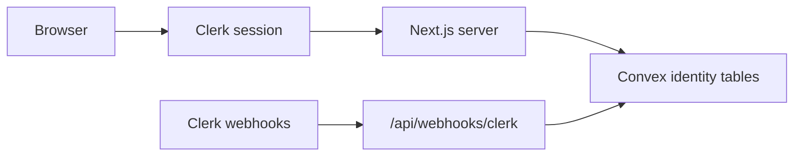

# Nexus P4 — Clerk Approved Users and Authoritative Convex Roles (v1)

**Package:** P4 identity and authorization boundary  
**Status:** Complete  
**Date:** 2026-06-30

## Summary

P4 establishes the authoritative human identity and authorization boundary for Nexus:

- **Clerk** authenticates human users.
- **Convex** is authoritative for approval, suspension, roles, and identity audit metadata.
- Browser-supplied roles, Clerk public metadata, and client JSON are never trusted for authorization.

No task persistence (P5), connector APIs (P6), or Claudia execution was added.

## Remote warning

The existing Git remote still points to the historical Odysseus repository:

`origin → https://github.com/pewdiepie-archdaemon/odysseus.git`

Do not push Nexus to this remote. Replace or remove `origin` before connecting Vercel or a Nexus GitHub repository.

## Identity architecture



| Layer | Responsibility |
|-------|----------------|
| Clerk | Human sign-in, session, JWT for Convex |
| Convex `approvedUsers` | Pending / active / suspended lifecycle |
| Convex `userRoles` | `knowledge_reader`, `nexus_admin` |
| Convex `identityAuditEvents` | Approval, suspension, role, webhook audit |
| Next.js `getNexusAccess()` | Server-side access resolver before shell render |

## Convex tables

### `approvedUsers`

Fields: `clerkUserId`, `primaryEmail`, `displayName?`, `status` (`pending` \| `active` \| `suspended`), lifecycle timestamps, `createdAt`, `updatedAt`.

Indexes: `by_clerk_user_id`, `by_primary_email`, `by_status`.

### `userRoles`

Fields: `clerkUserId`, `role` (`knowledge_reader` \| `nexus_admin`), grant/revoke metadata, `active`.

Indexes: `by_clerk_user_id`, `by_clerk_user_id_and_role`, `by_role_and_active`.

### `identityAuditEvents`

Event types: `user_seen`, `user_approved`, `user_suspended`, `user_reactivated`, `role_granted`, `role_revoked`, `clerk_user_updated`, `clerk_user_deleted`.

Indexes: `by_target_and_at`, `by_event_type_and_at`, `by_at`, `by_dedupe_key` (webhook idempotency).

## Convex modules

| Module | Functions |
|--------|-----------|
| `convex/users.ts` | `ensurePendingUser`, `currentUserAccess`, `currentUserProfile`, `currentUserRoles` |
| `convex/roles.ts` | `grantRoleInternal`, `revokeRoleInternal` |
| `convex/admin.ts` | `listUsersByStatus`, `approveUser`, `suspendUser`, `reactivateUser`, `adminGrantRole`, `adminRevokeRole` |
| `convex/identityAudit.ts` | `recordIdentityAuditEvent` |
| `convex/webhookIngest.ts` | `processClerkWebhook` |
| `convex/lib/auth.ts` | `requireAuthenticatedIdentity`, `requireApprovedUser`, `requireRole`, `requireAnyRole`, `getActiveRolesForUser` |
| `convex/lib/permissions.ts` | Canonical role → permission map |
| `convex/lib/bootstrap.ts` | `NEXUS_BOOTSTRAP_ADMIN_EMAILS` parsing, `shouldBootstrapAdmin` |
| `convex/lib/errors.ts` | Stable error codes |

## Roles and permissions

Canonical definition: `convex/lib/permissions.ts` (re-exported by `lib/auth/permissions.ts` for display).

| Role | Permissions |
|------|-------------|
| `knowledge_reader` | `nexus.access`, `knowledge.read`, `task.history.read_own`, `sources.read` |
| `nexus_admin` | `nexus.access`, `users.read`, `users.approve`, `users.suspend`, `roles.manage`, `identity.audit.read` |

Task submission permissions are named for future P5 use but not enabled.

## Approval lifecycle

1. User signs in via Clerk.
2. Server calls `ensurePendingUser` with verified Clerk identity.
3. No record → create `pending` (or bootstrap to `active` if allowed).
4. `getNexusAccess()` maps Convex state to routing:
   - `pending` → `/pending-approval`
   - `suspended` → `/access-suspended`
   - `approved_without_role` → `/pending-approval` (role assignment message)
   - `approved` → Nexus shell `/`
5. Active users without roles cannot access the shell.
6. No public self-approval.

## Admin bootstrap

Mechanism: **server-only email allowlist** `NEXUS_BOOTSTRAP_ADMIN_EMAILS`.

- Parsed in Convex (`convex/lib/bootstrap.ts`).
- Applies only when **no active `nexus_admin`** exists.
- Grants `nexus_admin` + `knowledge_reader` and records audit events with actor `system:bootstrap`.
- **Disabled automatically** once any active `nexus_admin` exists.
- Fail closed when env is absent or empty.
- No hardcoded operator email in source.

Set in Convex dashboard (and optionally mirror in Next.js `.env.local` for local dev). Never expose via `NEXT_PUBLIC_*`.

## Clerk webhook

Route: `app/api/webhooks/clerk/route.ts`

- Verifies Svix signature via `verifyWebhook` from `@clerk/nextjs/webhooks` using `CLERK_WEBHOOK_SECRET`.
- Rejects unsigned or malformed requests (400).
- Returns 503 when webhook/Convex/internal secret not configured.
- Forwards verified events to Convex `processClerkWebhook` with `NEXUS_INTERNAL_API_SECRET`.
- Idempotent via `dedupeKey = clerk:{eventId}` on `identityAuditEvents`.

Handled events:

| Event | Behavior |
|-------|----------|
| `user.created` | Upsert pending user; bootstrap if allowed |
| `user.updated` | Update email/display name only |
| `user.deleted` | Suspend user, deactivate roles, audit |

### Clerk dashboard setup (manual)

1. Create webhook endpoint → `https://<your-domain>/api/webhooks/clerk`
2. Subscribe to `user.created`, `user.updated`, `user.deleted`
3. Copy signing secret → `CLERK_WEBHOOK_SECRET`
4. Create JWT template named **`convex`** for Convex auth
5. Set `CLERK_JWT_ISSUER_DOMAIN` in Next.js and Convex dashboard
6. Set `NEXUS_INTERNAL_API_SECRET` in Next.js and Convex dashboard
7. Optionally set `NEXUS_BOOTSTRAP_ADMIN_EMAILS` in Convex dashboard

## Clerk ↔ Convex auth configuration

File: `convex/auth.config.ts`

Uses `CLERK_JWT_ISSUER_DOMAIN` with `applicationID: "convex"`. Configure the same issuer in the Convex dashboard authentication settings.

## Protected / public routes

**Public** (`proxy.ts`):

- `/sign-in(.*)`
- `/pending-approval`
- `/access-suspended`
- `/configuration-required`
- `/api/webhooks/clerk`
- Static assets

**Protected:**

- `/` (Nexus shell — requires active user + role)
- `/admin/access` (requires `nexus_admin`)
- Authenticated Convex queries/mutations

Authorization is enforced in Convex mutations/queries and in server components via `getNexusAccess()`, not only in `proxy.ts`.

## Production fail-closed

When `NODE_ENV=production` and Clerk or Convex is not configured (placeholder/missing env):

- `getNexusAccess()` returns `configuration_required`
- `/` redirects to `/configuration-required`
- Layout does not show dev-only config notice in production
- No fake approved session

Development without keys may still render the shell with a configuration notice.

## Admin UI

Route: `/admin/access`

- Server gate: `nexus_admin` required
- Lists pending, active, suspended users with roles
- Actions: approve, suspend, reactivate, grant/revoke roles
- All mutations re-check `nexus_admin` in Convex
- Last active `nexus_admin` cannot be revoked or suspended without another admin

## Last-admin safety

- `revokeRoleInternal` throws `last_admin` when revoking the only active `nexus_admin`
- `suspendUser` throws `last_admin` when suspending the only active `nexus_admin`
- Self-suspend requires `confirmSelf` (not yet wired in minimal UI; API supports it)

## Environment variables

| Variable | Visibility | Purpose |
|----------|------------|---------|
| `NEXT_PUBLIC_CLERK_PUBLISHABLE_KEY` | Browser | Clerk client |
| `NEXT_PUBLIC_CONVEX_URL` | Browser | Convex client |
| `CLERK_SECRET_KEY` | Server | Clerk server SDK |
| `CLERK_WEBHOOK_SECRET` | Server | Webhook verification |
| `CLERK_JWT_ISSUER_DOMAIN` | Server + Convex | JWT issuer for Convex auth |
| `NEXUS_INTERNAL_API_SECRET` | Server + Convex | Webhook → Convex bridge |
| `NEXUS_BOOTSTRAP_ADMIN_EMAILS` | Convex (+ optional server mirror) | First admin bootstrap |
| `CONVEX_DEPLOYMENT` | Local CLI | Convex dev/deploy |

Never use `NEXT_PUBLIC_` for secrets.

## Tests

File: `tests/nexus-p4-auth.test.ts`

Covers: access states, permission policy, bootstrap fail-closed, webhook signature requirement, idempotency contract, last-admin guards, production fail-closed, secret hygiene, routing policy.

Also: `tests/boundary-static.test.ts`, `scripts/verify-nexus-boundary.sh`.

## Validation results (2026-06-30)

| Command | Result |
|---------|--------|
| `npx convex codegen` | PASS |
| `npm run lint` | PASS |
| `npm run typecheck` | PASS |
| `npm test` | PASS (33 tests) |
| `npm run build` | PASS |
| `./scripts/verify-nexus-boundary.sh` | PASS |

Convex dashboard: `CLERK_JWT_ISSUER_DOMAIN` set to placeholder during codegen (`https://placeholder.clerk.accounts.dev`). Operator must replace with real Clerk issuer before production auth works.

## Validation commands

```bash
npx convex codegen
npm run lint
npm run typecheck
npm test
npm run build
./scripts/verify-nexus-boundary.sh
```

Record exact results in commit closeout (run at package completion).

## What remains for P5

- `nexusTasks` and task persistence
- Chat submission / composer enablement
- Task history storage
- Connector installations and credentials
- HMAC connector API
- Claims, leases, presence
- Claudia Core execution paths

## Exact next step

Begin **P5 — task persistence** only after operator confirms Clerk JWT template, Convex auth issuer, webhook endpoint, and bootstrap admin are configured in the target environment.
