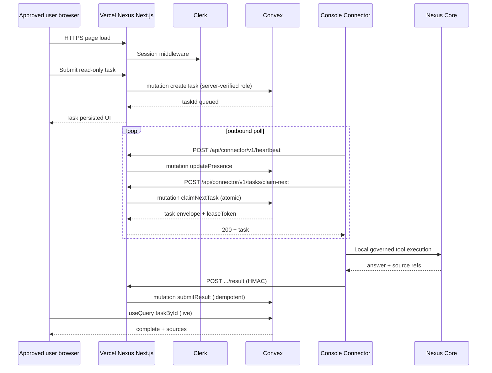

# Nexus Vercel + Convex Architecture Correction v1

| Field | Value |
|-------|-------|
| **Document** | `docs/specs/nexus_vercel_convex_architecture_correction_v1.md` |
| **Pass type** | Architecture correction and implementation-readiness — **no implementation** |
| **Date** | 2026-06-30 |
| **Supersedes** | Target **implementation** recommendations in `nexus_hosted_console_architecture_audit_v1.md` |
| **Repository** | `/Users/bretthoffman/Documents/console` |
| **Related repo** | `/Users/bretthoffman/Documents/system` (connector — not modified in this pass) |

---

**This document supersedes the Railway/Fly.io and PostgreSQL implementation recommendations in `nexus_hosted_console_architecture_audit_v1.md`. The valid current-state audit findings remain useful; the target implementation is Vercel + GitHub + Next.js/TypeScript + Clerk + Convex.**

---

## 1. Purpose and scope

This correction addendum:

- Preserves valid **current-state** findings from audit v1 (FastAPI layout, auth gaps, boundary violations, rename inventory, connector contract concepts).
- Explicitly **supersedes** hosting, persistence, claim/lease SQL, deployment, and package-plan sections that assumed Railway/Fly/PostgreSQL/uvicorn.
- Defines the **authoritative hosted target**: Nexus on **Vercel**, deployed from **GitHub**, built as **Next.js + TypeScript**, with **Clerk** (human auth) and **Convex** (persistence, task coordination, scheduled recovery).
- Evaluates **migration vs rebuild**, frontend reuse, Convex schema, connector API placement, and a corrected implementation sequence.
- Defines the **first implementation package** without executing it.

**Not done in this pass:** Next.js scaffold, Convex deploy, Clerk tenant, Vercel project, application code changes, `system` changes.

---

## 2. Original audit sections — what remains vs what is superseded

| Audit v1 section | Status |
|------------------|--------|
| §1 Executive summary (current state) | **Retain** — legacy local console = FastAPI + static SPA |
| §1 Audit recommendation (Railway/Postgres phases) | **Superseded** — see §12 |
| §2 Current architecture | **Retain** — accurate as legacy/local reference |
| §3 Request-flow diagrams | **Retain** — documents what must **not** be ported to Nexus |
| §4 Auth audit (bcrypt, no Clerk) | **Retain** — motivates Clerk migration |
| §5 Persistence audit (SQLite) | **Retain** — motivates Convex; not Nexus storage |
| §6 Hosting blockers | **Retain** — most still apply; replace DB blocker with Convex |
| §7 Boundary map | **Retain** — still valid trust model |
| §8 Rename matrix | **Retain** — update target paths for Next.js (§9) |
| §9 Task domain model (fields) | **Retain conceptually** — re-express in Convex (§6) |
| §10 State transitions | **Retain** — unchanged semantics |
| §11 Claim/lease (SQL `FOR UPDATE SKIP LOCKED`) | **Superseded** — Convex mutations (§7) |
| §12 Connector API contract (paths/auth concepts) | **Retain shape** — host on Vercel/Convex (§8) |
| §13 Human vs machine identity | **Retain** — Clerk ≠ connector |
| §14 Presence model | **Retain** — store in Convex `connectorPresence` |
| §15 Source minimization | **Retain** |
| §16 Deployment (Railway/Fly/Postgres) | **Superseded** — Vercel + Convex (§11) |
| §17 Security findings | **Retain** |
| §18 Technical debt | **Retain** |
| §19 Package plan (Phases 2–10 Postgres) | **Superseded** — §12 |
| §20 Open questions Q1–Q10 | **Partially resolved** — §14 |
| §21–22 Appendices / evidence | **Retain** |

---

## 3. Authoritative fixed constraints

| # | Constraint |
|---|------------|
| 1 | Hosted product name: **Nexus** |
| 2 | Deploy to **Vercel** from **GitHub** |
| 3 | Hosted persistence/coordination: **Convex** |
| 4 | Hosted runtime: **Node.js/TypeScript**, preferably **Next.js** |
| 5 | Human auth: **Clerk** |
| 6 | **Nexus** = private local OS/authority; **Nexus Core** never inbound-public |
| 7 | **Console Connector** = outbound HTTPS to Nexus only |
| 8 | FastAPI app is **not** the hosted Nexus runtime |
| 9 | **No** Railway, Fly.io, hosted uvicorn worker, managed PostgreSQL for Nexus |
| 10 | Preserve visual design/CSS/usable UX where practical |
| 11 | **No** public CLI Mirror, shell, Hermes PTY, agent-loop, service control on Nexus MVP |
| 12 | **Nexus** naming retained for Core, tools, connector, `NEXUS_*` local config |

---

## 4. Corrected target architecture

### 4.1 End-to-end flow



### 4.2 Responsibility by runtime zone

| Concern | Browser | Next.js (Vercel) | Convex | Connector | Nexus Core |
|---------|---------|------------------|--------|-----------|--------------|
| UI / layout / theme | ✓ client components | ✓ server components shell | — | — | — |
| Clerk session UX | ✓ | ✓ middleware + server | — | — | — |
| Approved-user gate | — | ✓ server checks | ✓ `approvedUsers` | — | — |
| Role enforcement | — | ✓ server | ✓ authoritative | — | — |
| Task create/history | ✓ forms | ✓ route handlers optional | ✓ mutations/queries | — | — |
| Task queue state | — | — | ✓ **source of truth** | — | — |
| Atomic claim/lease | — | ✓ verify connector auth | ✓ transactional mutation | ✓ caller | — |
| Connector HMAC verify | — | ✓ route handlers | — | ✓ sign | — |
| Presence | ✓ display | — | ✓ `connectorPresence` | ✓ heartbeat | — |
| Lease recovery cron | — | — | ✓ scheduled functions | — | — |
| Tool execution | — | **never** | **never** | ✓ allowlist | ✓ |
| Hermes / PTY / shell | **never** | **never** | **never** | local ops only | local |

### 4.3 No inbound path to Nexus

Nexus **must not** call `NEXUS_CORE_URL`, open tunnels, or proxy to the Nexus Mac. All Nexus interaction is **connector-initiated outbound HTTPS** to Vercel.

Audit v1 flows (`nexus_client.forward_message`, CLI relay, browser chat bridge to Gateway) are **anti-patterns** for hosted Nexus.

---

## 5. Migration vs rebuild — evaluation and recommendation

### 5.1 Options considered

| Option | Description | Pros | Cons |
|--------|-------------|------|------|
| **A. Incremental convert** | Replace FastAPI routes with Next API routes in same tree | Fewer new folders | Two runtimes, Odysseus authority entangled, Vercel builds Python poorly, Convex awkward beside SQLite |
| **B. Reference + new root** | Keep `static/`, add `nexus/` Next app | Clear separation | Some duplication during port |
| **C. Clean Nexus shell + port assets** | New Next structure; CSS/components ported deliberately | Clean boundaries, Vercel-native, eliminates dual-production ambiguity | Upfront structure work |

### 5.2 Decision criteria scores (qualitative)

| Criterion | A | B | C |
|-----------|---|---|---|
| Long-term maintainability | Poor | Good | **Best** |
| Vercel compatibility | Poor | **Best** | **Best** |
| Convex integration | Poor | Good | **Best** |
| Clerk integration | Fair | Good | **Best** |
| Remove local execution surfaces | Poor | Good | **Best** |
| Preserve UI quality | Good | Good | **Best** (CSS port) |
| Eliminate Odysseus authority ambiguity | Poor | Good | **Best** |
| Safe GitHub deploy | Fair | **Best** | **Best** |

### 5.3 Concrete recommendation: **Option C (with B’s repo layout)**

Create a **clean Nexus Next.js application** in a dedicated directory within this repository, port **CSS and selected UI behavior** from `static/`, and **freeze** the FastAPI tree as **legacy local-only** (see §15).

**Do not** incrementally convert FastAPI into the production hosted app (Option A).

**Suggested repo layout after Phase 2:**

```
console/                    # GitHub repo (name may change later)
├── nexus/                          # Vercel Root Directory (Next.js 15 App Router)
│   ├── app/
│   ├── components/
│   ├── lib/
│   ├── public/
│   ├── styles/                     # Ported from static/style.css (split modules)
│   ├── package.json
│   ├── next.config.ts
│   └── tsconfig.json
├── convex/                         # Convex backend (repo root — standard layout)
│   ├── schema.ts
│   ├── tasks.ts
│   ├── connector.ts
│   ├── users.ts
│   └── crons.ts
├── static/                         # Legacy SPA reference (unchanged until port complete)
├── app.py                          # Legacy FastAPI — local legacy local console only
├── vercel.json                     # { "buildCommand": "cd nexus && ...", ... } or project UI
└── docs/specs/
```

Vercel project setting: **Root Directory = `nexus`**, with Convex deployed via `npx convex deploy` from repo root (monorepo pattern).

---

## 6. Frontend reuse audit

### 6.1 Asset classification

| Asset | Lines (approx.) | Classification | Nexus action |
|-------|-----------------|----------------|--------------|
| `static/style.css` | ~35,600 | **Reusable after extraction** | Import into `nexus/styles/`; split into `globals.css`, `chat.css`, `theme-vars.css`; strip local-only selectors (CLI mirror, cookbook, bash) in later pass |
| `static/index.html` | ~2,290 | **Visual reference** | Recreate as `nexus/app/layout.tsx` + page components; do not mount raw HTML |
| `static/app.js` | ~3,860 | **Reusable after module conversion** | Decompose into React components over multiple packages; not one-shot port |
| `static/js/chat.js` | ~4,300 | **Reusable after module conversion** | Port **read-only chat + task submit** subset; drop agent/SSE-to-FastAPI paths |
| `static/js/sessions.js` | ~3,170 | **Partial port** | Task **history** sidebar pattern reusable; session CRUD tied to FastAPI `/api/session` → replace with Convex task threads |
| `static/js/storage.js` | ~120 | **Reusable almost directly** | Port to `lib/storage.ts`; rename keys `odysseus-*` → `nexus-*` with dual-read migration |
| `static/js/theme.js` | ~2,090 | **Reusable after module conversion** | Port theme presets + CSS variable application to React context/hook |
| `static/js/nexusBrowserChatBridge.js` | ~150 | **Obsolete for Nexus** | Replaced by Convex task mutations + queries; keep `extractAssistantContent` logic as reference for result rendering |
| `static/js/nexusConsoleMode.js` | ~170 | **Obsolete for Nexus** | Nexus is always "hosted safe mode"; no Gateway health flag |
| `static/js/nexusDashboard.js` | ~395 | **Partial port** | Presence + queue status UI → new `NexusStatusPanel`; drop Hermes runtime card, Gateway packet list |
| `static/js/nexusModelSelector.js` | ~160 | **Local-only — must not ship** | Model config writes prohibited on MVP |
| `static/js/nexusCliMirror.js` | ~1,370 | **Local-only — must not ship** | — |
| `static/js/nexusCliMirrorHelpers.js` | large | **Local-only — must not ship** | PTY parsing must not enter Nexus |
| `static/manifest.json` | small | **Reusable after edit** | PWA optional on Vercel; rename to Nexus; Next.js `app/manifest.ts` preferred |
| `static/sw.js` | ~145 | **Obsolete / redesign** | Vercel + Next caching strategy differs; defer PWA service worker to post-MVP |
| `static/login.html` | ~575 | **Obsolete** | Replace with Clerk `<SignIn />` / hosted Clerk pages |

### 6.2 Can visual style be preserved in React/Next.js?

**Yes.** The design is **CSS-variable-driven** (`--bg`, `--fg`, `--panel`, `--brand-color`, bubble colors, density classes). `index.html` inline boot script and `theme.js` apply variables to `document.documentElement` — this maps cleanly to:

1. Copy core variable definitions and component classes from `style.css`.
2. A `ThemeProvider` React context that applies the same variables.
3. JSX markup mirroring existing class names (`.chat-container`, `.chat-input-bar`, `.sidebar`, etc.).

**Do not** preserve architectural coupling: `fetch('/api/chat_stream')`, `EventSource` to Gateway, `credentials: 'same-origin'` to FastAPI, or DOM-driven modal system from `ui.js` without refactoring.

### 6.3 Port priority (MVP)

1. Global layout + sidebar shell + theme variables  
2. Chat input bar + message list (read-only mode)  
3. Task status / result / sources panels  
4. Presence chip (Nexus online/offline)  
5. Task history list  
6. Diagnostics drawer (expandable)

---

## 7. Convex schema design

### 7.1 Tables

#### `approvedUsers`

| Field | Type | Notes |
|-------|------|-------|
| `clerkUserId` | string | Primary lookup |
| `email` | string | Denormalized from Clerk webhook |
| `displayName` | optional string | |
| `status` | union | `active` \| `suspended` |
| `invitedAt` | number | ms |
| `approvedAt` | optional number | |
| `createdAt` | number | |

**Indexes:** `by_clerk_user_id` (unique), `by_email`

#### `userRoles`

| Field | Type | Notes |
|-------|------|-------|
| `clerkUserId` | string | |
| `role` | string | e.g. `knowledge_reader`, `admin` |
| `grantedAt` | number | |
| `grantedBy` | optional string | admin clerk id |

**Indexes:** `by_clerk_user_id`, `by_clerk_user_id_and_role` (unique pair)

**Authority recommendation:** Roles live in **Convex** (authoritative for task policy). Clerk `publicMetadata.role` optional mirror for UI hints only — **never trusted alone**.

#### `nexusTasks`

| Field | Type | Notes |
|-------|------|-------|
| `taskId` | string | External id (uuid) — also document `_id` optional |
| `requestingClerkUserId` | string | |
| `requestingUserRole` | string | Snapshot at creation |
| `requestedToolId` | string | |
| `validatedArguments` | any | JSON object |
| `authorityLevel` | string | `read_only` initially |
| `createdAt` | number | |
| `expiresAt` | number | |
| `status` | string | See audit v1 §10 |
| `connectorId` | optional string | Set on claim |
| `claimedAt` | optional number | |
| `leaseExpiresAt` | optional number | |
| `leaseToken` | optional string | Server-generated secret |
| `attemptNumber` | number | default 1 |
| `taskVersion` | number | default 1, increment on claim/renew |
| `idempotencyKey` | optional string | Per-user submit dedupe |
| `progress` | optional object | `{phase, percent?, message?}` |
| `answer` | optional any | Structured answer |
| `sources` | optional array | Source refs — minimized |
| `warnings` | optional string[] | |
| `partial` | boolean | |
| `structuredError` | optional object | |
| `model` | optional string | Display metadata |
| `traceId` | string | |
| `startedAt` | optional number | |
| `completedAt` | optional number | |
| `durationMs` | optional number | |
| `auditMetadata` | optional object | |

**Indexes:**

| Index name | Fields | Purpose |
|------------|--------|---------|
| `by_status_and_createdAt` | `[status, createdAt]` | Oldest eligible `queued` task |
| `by_clerkUserId_and_createdAt` | `[requestingClerkUserId, createdAt]` | User history (desc in query) |
| `by_connectorId_and_status` | `[connectorId, status]` | Active task per connector |
| `by_leaseExpiresAt` | `[leaseExpiresAt]` | Recovery sweep |
| `by_idempotencyKey` | `[requestingClerkUserId, idempotencyKey]` | Submit dedupe |
| `by_traceId` | `[traceId]` | Support/debug |

#### `connectorInstallations`

| Field | Type |
|-------|------|
| `connectorId` | string (uuid) |
| `label` | optional string |
| `status` | `active` \| `revoked` \| `disabled` |
| `allowedToolIds` | string[] |
| `maxConcurrentTasks` | number (default 1) |
| `createdAt` | number |
| `revokedAt` | optional number |

**Indexes:** `by_connectorId` (unique), `by_status`

#### `connectorCredentials`

| Field | Type | Notes |
|-------|------|-------|
| `connectorId` | string | |
| `secretHash` | string | bcrypt or HMAC key hash |
| `secretPrefix` | string | For lookup |
| `rotatedAt` | number | |
| `expiresAt` | optional number | |

**Indexes:** `by_connectorId`, `by_secretPrefix`

Never store plaintext secrets in Convex — only hashes. Plaintext shown once at pairing.

#### `connectorPresence`

| Field | Type |
|-------|------|
| `connectorId` | string |
| `status` | `online` \| `busy` \| `offline` \| `error` \| `disabled` |
| `lastHeartbeatAt` | number |
| `lastError` | optional string |
| `currentTaskId` | optional string |
| `softwareVersion` | optional string |
| `queueDepthSeen` | optional number |

**Indexes:** `by_connectorId` (unique), `by_lastHeartbeatAt`

#### `connectorNonces`

| Field | Type | Notes |
|-------|------|-------|
| `connectorId` | string | |
| `nonce` | string | |
| `seenAt` | number | TTL via scheduled cleanup |

**Indexes:** `by_connectorId_and_nonce` (unique)

#### `taskIdempotency`

| Field | Type | Notes |
|-------|------|-------|
| `scope` | string | `submit` \| `progress` \| `result` \| `failure` |
| `taskId` | string | |
| `idempotencyKey` | string | |
| `responseSnapshot` | optional any | Cached ack |
| `createdAt` | number | |

**Indexes:** `by_scope_taskId_key` (unique composite)

#### `taskProgressEvents` (bounded activity)

| Field | Type |
|-------|------|
| `taskId` | string |
| `seq` | number |
| `phase` | string |
| `message` | optional string |
| `at` | number |

**Indexes:** `by_taskId_and_seq` — cap retention per task (e.g. last 50) in mutation.

#### `auditEvents`

| Field | Type |
|-------|------|
| `at` | number |
| `actorType` | `user` \| `connector` \| `system` |
| `actorId` | string |
| `action` | string |
| `taskId` | optional string |
| `metadata` | optional object |

**Indexes:** `by_taskId`, `by_at`

### 7.2 Configuration (not hardcoded in scattered code)

Store tunables in Convex `systemConfig` document or environment-backed constants file `convex/config.ts`:

```typescript
export const TASK_POLICY = {
  defaultLeaseSeconds: 900,
  taskTimeoutSeconds: 1200,
  maxAttempts: 3,
  sourceExcerptMaxChars: 500,
  allowedToolsReadOnly: [
    "vault.agentic_retrieval",
    "membership_io.transcript_retrieve",
  ],
} as const;
```

---

## 8. Convex-native atomic claim and lease semantics

### 8.1 Why not SQL

Audit v1 proposed PostgreSQL `FOR UPDATE SKIP LOCKED`. **That mechanism is superseded.** Convex **mutations** are transactional: all reads and writes in a single mutation appear atomic from the client's perspective.

### 8.2 `claimNextTask` mutation (authoritative logic)

Pseudocode for `convex/connector.ts`:

```typescript
export const claimNextTask = internalMutation({
  args: {
    connectorId: v.string(),
    supportedToolIds: v.array(v.string()),
    leaseSeconds: v.optional(v.number()),
  },
  handler: async (ctx, args) => {
    // 1. Verify connector installation active (separate auth layer may pre-verify)
    const installation = await ctx.db
      .query("connectorInstallations")
      .withIndex("by_connectorId", (q) => q.eq("connectorId", args.connectorId))
      .unique();
    if (!installation || installation.status !== "active") throw new Error("connector_forbidden");

    // 2. v1: connector must not already hold active task
    const held = await ctx.db
      .query("nexusTasks")
      .withIndex("by_connectorId_and_status", (q) =>
        q.eq("connectorId", args.connectorId).eq("status", "claimed")
      )
      .first();
    if (held) throw new Error("connector_busy");
    const heldRunning = await ctx.db
      .query("nexusTasks")
      .withIndex("by_connectorId_and_status", (q) =>
        q.eq("connectorId", args.connectorId).eq("status", "running")
      )
      .first();
    if (heldRunning) throw new Error("connector_busy");

    // 3. Find oldest eligible queued task (filter expired + tool support in application logic)
    const now = Date.now();
    const candidates = await ctx.db
      .query("nexusTasks")
      .withIndex("by_status_and_createdAt", (q) => q.eq("status", "queued"))
      .order("asc")
      .take(32);

    const task = candidates.find(
      (t) =>
        t.expiresAt > now &&
        args.supportedToolIds.includes(t.requestedToolId) &&
        TASK_POLICY.allowedToolsReadOnly.includes(t.requestedToolId)
    );
    if (!task) return { task: null };

    // 4. Atomic patch — Convex serializes concurrent mutations
    const leaseToken = crypto.randomUUID();
    const leaseMs = (args.leaseSeconds ?? TASK_POLICY.defaultLeaseSeconds) * 1000;
    await ctx.db.patch(task._id, {
      status: "claimed",
      connectorId: args.connectorId,
      claimedAt: now,
      leaseExpiresAt: now + leaseMs,
      leaseToken,
      attemptNumber: task.attemptNumber + 1,
      taskVersion: task.taskVersion + 1,
    });

    const updated = await ctx.db.get(task._id);
    return { task: updated, leaseToken, taskVersion: updated!.taskVersion };
  },
});
```

**Concurrency note:** If two connectors race, Convex serializes mutations; the second may get the next task or null. For stricter "claim exactly one row" under high contention, add a conditional check immediately before patch that re-reads `task.status === 'queued'`.

### 8.3 Lease renewal

`renewLease` mutation:

- Args: `taskId`, `leaseToken`, `taskVersion`
- Verify `status` in (`claimed`, `running`), token match, version match
- Patch `leaseExpiresAt = now + leaseMs`, `taskVersion++`
- Return new expiry + version

### 8.4 Stale result rejection

`submitResult` / `submitProgress` / `submitFailure`:

- Require matching `leaseToken` and `taskVersion`
- On mismatch → error code `stale_write` (HTTP 409 at route layer)
- Check `taskIdempotency` table first for connector `idempotencyKey`

### 8.5 Recovery (no Vercel long-running worker)

Use **Convex scheduled functions** (`convex/crons.ts`):

| Job | Interval | Action |
|-----|----------|--------|
| `sweepExpiredLeases` | every 1 min | `claimed`/`running` where `leaseExpiresAt < now` → `queued` or `failed` if max attempts |
| `expireQueuedTasks` | every 5 min | `queued` where `expiresAt < now` → `expired` |
| `pruneNonces` | every 10 min | Delete `connectorNonces` older than TTL |
| `pruneProgressEvents` | daily | Trim old events |

**No** uvicorn worker, **no** Fly/Railway cron — Convex crons are authoritative.

### 8.6 Cancellation

User mutation `cancelTask`: only if `status === 'queued'` and `requestingClerkUserId` matches (or admin).

### 8.7 Retry

On retryable failure: if `attemptNumber < maxAttempts`, set `status: 'queued'`, clear `connectorId`, `leaseToken`, increment version.

---

## 9. Vercel and Convex API boundary

### 9.1 Recommended architecture: **hybrid**

| Layer | Responsibility |
|-------|----------------|
| **Next.js Route Handlers** (`nexus/app/api/connector/v1/*`) | HMAC verification, timestamp/nonce checks, rate limiting, request size limits, map errors to HTTP |
| **Convex internal mutations** | Authoritative state changes (`claimNextTask`, `submitResult`, …) |
| **Convex queries** | Browser live updates via `useQuery` |
| **Convex actions** | **Not** used for connector auth path initially (keep crypto on Node route handlers) |

**Why not Convex HTTP actions alone?** Connector signing verification needs stable Node `crypto`, secret loading, and consistent logging — Route Handlers are a natural fit on Vercel. Convex remains the **only** mutator of task rows.

**Why not Route Handlers alone?** Duplicating storage in Vercel would violate Convex-as-source-of-truth constraint.

### 9.2 Connector endpoint map (unchanged paths from audit v1)

| Method | Path | Route handler | Convex |
|--------|------|---------------|--------|
| POST | `/api/connector/v1/heartbeat` | verify HMAC | `updatePresence` |
| POST | `/api/connector/v1/tasks/claim-next` | verify HMAC | `claimNextTask` |
| POST | `/api/connector/v1/tasks/{id}/lease/renew` | verify HMAC | `renewLease` |
| POST | `/api/connector/v1/tasks/{id}/progress` | verify HMAC | `submitProgress` |
| POST | `/api/connector/v1/tasks/{id}/result` | verify HMAC | `submitResult` |
| POST | `/api/connector/v1/tasks/{id}/failure` | verify HMAC | `submitFailure` |
| POST | `/api/connector/v1/tasks/{id}/release` | verify HMAC | `releaseTask` |
| GET | `/api/connector/v1/queue/status` | verify HMAC | `queueStatus` query |

Human routes (Clerk-protected):

| Method | Path | Implementation |
|--------|------|----------------|
| POST | `/api/nexus/v1/tasks` | Server action or route → Convex `createTask` |
| GET | `/api/nexus/v1/tasks/{id}` | Convex query (or server wrapper) |
| GET | `/api/nexus/v1/tasks` | Convex paginated query |

**Recommendation:** Use **`/api/nexus/v1`** for human JSON APIs immediately (resolves audit Q1). Keep `/api/connector/v1` for machine paths.

### 9.3 HMAC verification (route handler)

Headers:

- `X-Connector-Id`
- `X-Request-Timestamp` (ms)
- `X-Request-Nonce`
- `X-Signature` = HMAC-SHA256(secret, `timestamp + "\n" + nonce + "\n" + method + "\n" + path + "\n" + bodyHash`)

Server-only env: `CONNECTOR_HMAC_PEPPER`, lookup `secretHash` from Convex via internal query.

### 9.4 Vercel constraints

| Constraint | Mitigation |
|------------|------------|
| Serverless timeout (10s hobby / 60s pro) | Connector calls are short; claim/result fit; no long poll on Vercel |
| No persistent filesystem | Convex only — no SQLite |
| Body size limits | Cap result payload (e.g. 256KB); store large excerpts as truncated |
| Outbound polling | Connector on Nexus Mac — **not** Vercel long-poll |

### 9.5 Browser updates

- **Convex `useQuery`** on `nexusTasks` for live status (preferred over SSE on Vercel).
- Optional polling fallback for diagnostics panel.

---

## 10. Clerk architecture

### 10.1 Placement

| Piece | Location |
|-------|----------|
| `clerkMiddleware()` | `nexus/middleware.ts` — protect `/`, `/chat`, `/history`, `/api/nexus/*` |
| Public routes | `/sign-in`, `/sign-up` (if ever enabled), static assets |
| Server enforcement | Every task mutation checks `auth().userId` + Convex `approvedUsers` + `userRoles` |
| Connector routes | **Excluded** from Clerk — HMAC only |

### 10.2 Approved-account model (small, preapproved)

1. Clerk sign-in allowed only for users in `approvedUsers` with `status: active`.
2. On first Clerk login, webhook (`user.created`) creates pending row — **not active** until operator approves (or pre-seed approved emails).
3. Middleware: if Clerk session valid but not approved → `/pending-approval` page.

**Recommendation:** **Invite-only** via Clerk Invitations + pre-populated `approvedUsers`/`userRoles` — not open registration.

### 10.3 `knowledge_reader` enforcement

At `createTask` (Convex mutation called from server):

```typescript
const role = await getRole(ctx, clerkUserId);
if (requestedToolId === "vault.agentic_retrieval" && !hasPermission(role, "knowledge_reader")) {
  throw new Error("forbidden");
}
```

**Reject browser-supplied `role` or `authorityLevel`** — compute from Convex only.

### 10.4 Clerk ↔ Convex mapping

| Event | Action |
|-------|--------|
| Clerk `user.created` | Webhook → Convex `upsertApprovedUserPending` |
| Operator approves | Admin UI → Convex `approveUser` + assign role |
| Clerk `user.deleted` | Convex suspend user, revoke active tasks optional |

Store **`clerkUserId`** as stable key (`user.id` from Clerk).

---

## 11. Rebranding correction (Next.js target)

### 11.1 User-visible Nexus (hosted)

| Current | Nexus target |
|---------|--------------|
| legacy local console | **Nexus** |
| Nexus Chat | **Nexus Chat** |
| Message Nexus... | **Ask Nexus...** |
| `manifest` Nexus | **Nexus** |
| `<title>legacy local console</title>` | `<title>Nexus</title>` |
| Login page | Clerk sign-in branded Nexus |

### 11.2 Retain Nexus

- Nexus Core, Nexus tools, Nexus machine, Console Connector, `NEXUS_*` env vars
- Source provenance labels: "Retrieved via Nexus · vault.agentic_retrieval"
- Presence: "**Nexus** online" (machine), not "Nexus online"

### 11.3 Internal / legacy docs

Do not mass-rename `docs/console_reform/` or historical package names.

### 11.4 Next.js file naming

| Legacy | Nexus |
|--------|-------|
| `nexusDashboard.js` | `components/nexus/StatusPanel.tsx` |
| `nexusBrowserChatBridge.js` | `lib/tasks/submitTask.ts` + Convex |
| `odysseus-theme` localStorage | `nexus-theme` |

---

## 12. Hosted feature scope (MVP)

### 12.1 Must include

- Clerk sign-in (approved users only)
- Read-only Chat mode (task-oriented Q&A, not agent loop)
- Task submission → Convex `queued`
- Offline/queued behavior (task persists when Nexus offline)
- Task status + result + sources + warnings + partial flag
- Task history (per user)
- Nexus online/offline/reconnecting indicator (from `connectorPresence`)
- Expandable diagnostics (trace ID, attempt, latency, structured error)
- Responsive layout ported from current CSS

### 12.2 Must not include (MVP)

- CLI Mirror, Hermes PTY, local shell
- Arbitrary Agent mode execution
- Model configuration writes
- Service control, file browser, log deletion, retention cleanup
- Raw Nexus credentials in browser
- Direct Core HTTP forwarding
- Cookbook, email, calendar, memory mutation, research jobs

### 12.3 Agent mode UI

**Recommendation:** Show **disabled** Agent toggle with tooltip "Coming later — governed execution only" rather than removing markup entirely. Matches user expectation from current UI while making capability boundary obvious. **Defer** final decision — safe to ship MVP with toggle hidden via feature flag `NEXUS_SHOW_AGENT_PLACEHOLDER=false` default off.

---

## 13. Corrected deployment architecture

### 13.1 GitHub → Vercel

1. Push to `main` → Vercel production deploy.
2. PR previews → Vercel preview + Convex preview deployment (`npx convex deploy --preview-create` pattern).
3. **Root Directory:** `nexus/`
4. **Build:** `cd nexus && npm ci && npm run build`
5. **Install:** Convex CLI in CI or Vercel build hook for `convex deploy`

### 13.2 Environment variables

| Variable | Where | Purpose |
|----------|-------|---------|
| `NEXT_PUBLIC_CLERK_PUBLISHABLE_KEY` | Vercel | Clerk browser |
| `CLERK_SECRET_KEY` | Vercel server only | Clerk server |
| `CLERK_WEBHOOK_SECRET` | Vercel | User sync |
| `NEXT_PUBLIC_CONVEX_URL` | Vercel | Convex client |
| `CONVEX_DEPLOY_KEY` | Vercel CI / server | Server-side Convex calls |
| `CONNECTOR_HMAC_PEPPER` | Vercel server only | Signature verification |
| `NEXUS_ENV` | Vercel | `production` \| `preview` |

**No** `DATABASE_URL`, **no** `NEXUS_CORE_URL` on Vercel.

### 13.3 What is explicitly absent on hosted Nexus

- uvicorn / FastAPI process
- SQLite / `data/auth.json`
- Local filesystem persistence
- Long-running Vercel background workers (use Convex crons)
- Inbound Nexus tunnel

### 13.4 Lease recovery

**Convex scheduled functions** (primary) + optional task-triggered cleanup on claim if stale lease detected.

---

## 14. Corrected implementation sequence

### Phase 1A — Architecture correction addendum ✅

This document.

### Phase 2 — Next.js / TypeScript / Convex / Clerk shell

| Package | **P2-nexus-shell** |
|---------|-------------------|
| Repo | `console` |
| Scope | `nexus/` Next 15 App Router, `convex/` bootstrap, Clerk middleware stub, env templates, Vercel config |
| Prerequisites | Phase 1A |
| Deliverables | Builds on Vercel; "Nexus" placeholder page; Convex connected; Clerk sign-in wall |
| Tests | `npm run build`, lint, typecheck |
| Non-goals | UI port, connector, tasks |
| Rollback | Remove `nexus/` directory |

### Phase 3 — Port branding and reusable UI

| Package | **P3-ui-port-foundation** |
|---------|--------------------------|
| Scope | Import `style.css` core vars, layout shell, theme provider, Nexus strings |
| Prerequisites | P2 |
| Batch with | P4 if desired after shell stable |

### Phase 4 — Clerk approval and role boundary

| Package | **P4-clerk-approval-roles** |
|---------|----------------------------|
| Scope | `approvedUsers`, `userRoles`, webhooks, middleware gate, `knowledge_reader` |
| Prerequisites | P2 |

### Phase 5 — Convex task persistence and user APIs

| Package | **P5-convex-tasks-user-api** |
|---------|------------------------------|
| Scope | `nexusTasks` CRUD, `createTask` mutation, history queries, idempotency |
| Prerequisites | P4 |

### Phase 6 — Connector API and claim/lease

| Package | **P6-connector-api-claims** |
|---------|------------------------------|
| Scope | Route handlers + Convex connector mutations + crons + presence |
| Prerequisites | P5 |

### Phase 7 — Console Connector (`system`)

| Package | **P7-connector-daemon** |
|---------|-------------------------|
| Repo | **`system`** — handoff |
| Scope | Outbound poll, HMAC sign, execute allowlisted tools |
| Prerequisites | P6 |

### Phase 8 — Control Center panel

| Package | **P8-control-center-ui** |
|---------|--------------------------|
| Repo | `system` |

### Phase 9 — Read-only Nexus tools integration

| Package | **P9-readonly-tools-e2e** |
|---------|---------------------------|
| Scope | `vault.agentic_retrieval`, `membership_io.transcript_retrieve` E2E |

### Phase 10 — Production deployment and hardening

| Package | **P10-prod-hardening** |
|---------|------------------------|
| Scope | Rate limits, audit export, monitoring, security review |

---

## 15. First implementation package (exact — do not execute yet)

### Package ID: **P2-nexus-shell**

**Goal:** Establish the correct production foundation for Vercel-hosted Nexus — **not** a FastAPI rename.

### Deliverables

| Item | Path / action |
|------|----------------|
| Hosted app package.json | `nexus/package.json` — next, react, typescript, @clerk/nextjs, convex |
| TypeScript config | `nexus/tsconfig.json` |
| Next config | `nexus/next.config.ts` |
| App Router | `nexus/app/layout.tsx`, `nexus/app/page.tsx`, `nexus/app/sign-in/[[...sign-in]]/page.tsx` |
| Clerk middleware scaffold | `nexus/middleware.ts` |
| Convex bootstrap | `convex/schema.ts` (minimal), `convex/tsconfig.json`, empty tables stub |
| Env template | `nexus/.env.example` — Clerk + Convex placeholders, no secrets |
| Vercel config | `nexus/vercel.json` or documented Vercel UI root directory |
| CSS preservation plan | `docs/specs/nexus_ui_port_plan.md` (optional one-pager) or section in README |
| Legacy boundary doc | `nexus/README.md` — states FastAPI is not production Nexus |
| Root pointer | Update root `README.md` with Nexus vs legacy local console section |

### Acceptance criteria

- `cd nexus && npm run build` succeeds locally (after deps installed in implementation pass).
- TypeScript strict mode passes.
- Clerk middleware protects `/` (redirect to sign-in).
- Convex dev connection documented (`npx convex dev`).
- No FastAPI routes added; no Python changes required for deploy.
- No connector endpoints yet.

### Non-goals

- Port `chat.js`, task logic, connector HMAC, branding sweep across `static/`
- Delete or modify `app.py`
- Provision Clerk/Convex/Vercel cloud resources in repo

### Rollback

Delete `nexus/` and `convex/`; revert README pointer.

---

## 16. Fate of the existing FastAPI application

| Role | Decision |
|------|----------|
| **Hosted Nexus production** | **Never** — FastAPI is not deployed to Vercel for Nexus |
| **Local legacy local console** | **Deprecated local-only compatibility** — retained for Nexus Mac operator workflows until UI port covers needed local surfaces |
| **Reference** | **Temporary reference** for CSS/UX and Gateway behavior during Phases 3–5 |
| **Removal** | After Nexus MVP reaches parity for hosted read-only chat + tasks, FastAPI may move to `legacy/` or separate branch — **not Phase 2** |
| **Naming** | Continue calling local app **legacy local console** in docs; **only** the Vercel app is **Nexus** |

**Avoid two products both branded Nexus:** Vercel deployment = Nexus; `./start-macos.sh` = legacy local console (legacy/local) until explicitly retired.

---

## 17. Settled decisions (removed from open list)

| Prior question | Resolution |
|----------------|------------|
| Hosting provider | **Vercel** |
| Deployment source | **GitHub** |
| Hosted database | **Convex** |
| Hosted runtime | **Node.js/TypeScript, Next.js** |
| PostgreSQL vs Convex | **Convex** |
| Railway vs Fly.io | **Neither** |
| Public CLI Mirror on Nexus | **No** |
| Inbound Core access | **No** |
| Product name | **Nexus** (hosted) |
| FastAPI as hosted runtime | **No** |
| Long-running Python worker | **No** |

---

## 18. Genuine remaining operator decisions

| ID | Question | Recommendation | Defer? |
|----|----------|----------------|--------|
| R1 | Rename GitHub repo `console` → `nexus` now? | **Defer** — rename after P2 shell; less churn during scaffold | Yes |
| R2 | Human API prefix `/api/nexus/v1` immediately? | **Yes** — use from P5 onward | No |
| R3 | Connector auth: HMAC vs Bearer+nonce? | **HMAC** (audit v1 option B) — worth complexity for public internet | No |
| R4 | Source excerpt max chars? | **500** default in `TASK_POLICY` | Yes |
| R5 | Disabled Agent toggle visible in MVP? | **Hidden by default**; placeholder behind flag | Yes |
| R6 | Clerk: single org vs individual users? | **Single Clerk application, individual approved users** in Convex — not multi-tenant SaaS | No |
| R7 | Is Nexus Core HTTP API ready for P9? | Still blocks connector execution — verify in `system` before P7 | Yes (operator verify) |
| R8 | PWA service worker on Vercel? | **Defer** post-MVP | Yes |

---

## 19. Security and boundary reminders

- Clerk session **never** authenticates `/api/connector/v1/*`.
- Browser **never** receives connector secrets.
- Nexus **never** calls Nexus Core HTTP.
- Convex mutations for tasks **never** trust client-supplied roles.
- Tunables live in `convex/config.ts` + `systemConfig`, not scattered magic numbers.

---

## 20. Validation checklist (this document)

Confirmed presence of required terms:

- [x] Vercel
- [x] GitHub
- [x] Next.js
- [x] TypeScript
- [x] Clerk
- [x] Convex
- [x] connector claim
- [x] lease
- [x] outbound-only
- [x] Nexus
- [x] Nexus boundary
- [x] first implementation package (P2-nexus-shell)

---

## 21. Files inspected (this pass)

- `docs/specs/nexus_hosted_console_architecture_audit_v1.md` (full review)
- `static/index.html`, `static/style.css` (scale/structure)
- `static/app.js`, `static/js/chat.js`, `static/js/sessions.js` (scale/coupling)
- `static/js/storage.js`, `static/js/theme.js`
- `static/js/nexusBrowserChatBridge.js`, `static/js/nexusConsoleMode.js`
- `static/js/nexusDashboard.js`, `static/js/nexusModelSelector.js`
- `static/js/nexusCliMirror.js` (header)
- `static/manifest.json`, `static/sw.js`, `static/login.html`

---

## 22. Explicit non-goals (this pass)

- No Next.js install or scaffold
- No Convex deployment or schema creation in repo
- No Clerk/Vercel/GitHub provisioning
- No application code changes (except documentation)
- No `system` modifications
- No FastAPI deletion
- No Phase 2 implementation start

---

*End of correction v1. Proceed with package **P2-nexus-shell** only after operator approval.*
